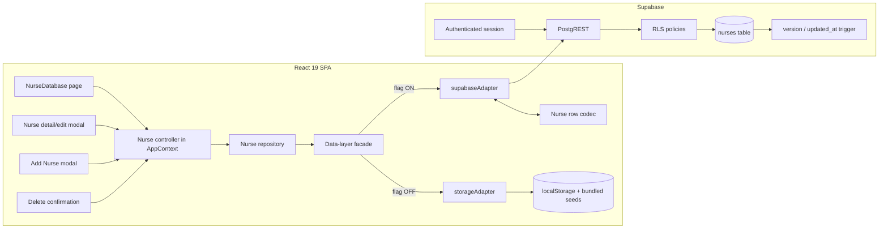

# Design Document: Nurse Management

## Overview

This feature delivers completed, feature-flagged nurse CRUD. With `SUPABASE_BACKEND` enabled, list and authoritative detail reads come only from the Supabase `nurses` table, and create, update, pipeline-change, and delete transitions enter shared state only after the selected adapter confirms them; successful writes remain visible after refresh. An empty Supabase table renders a genuine empty state. With the flag disabled, the established localStorage representation, initialization conditions, seven bundled nurses, and refresh behavior remain unchanged.

The completed implementation removes the split-brain behavior diagnosed at the reviewed baseline (`main` at `d7162b3`). At that baseline, `AppContext` hydrated nurses through the feature-routed data layer while `NurseDatabase.jsx` independently read and wrote localStorage, unconditional domain initialization could seed seven local nurses, Supabase rows crossed the boundary in snake_case, and nurse cards autosaved whole objects. The current flow instead uses the module-selected adapter, explicit nurse codec, record-level repository, server-confirmed controller state, and explicit Save/Cancel lifecycle.

Supabase and local nurse stores remain intentionally isolated: no nurse is migrated, copied, merged, reconciled, or used as fallback between modes. This document describes the completed scope and its preserved invariants; it does not add offline writes, background synchronization, schema replacement, or other new implementation work.

### Goals

- Use one authoritative nurse source selected by `SUPABASE_BACKEND` at page load.
- Provide visible Add Nurse, detail/edit/save, conflict resolution, and confirmed delete flows.
- Preserve row `version` through reads and use it on every update/delete.
- Set a generated text `id` and the authenticated user's UUID as `owner_id` on create.
- Treat RLS as the authorization boundary; UI permission checks are usability only.
- Preserve drafts across recoverable failures and provide actionable loading, empty, validation, permission, network, retry, conflict, stale, and not-found UX.
- Preserve feature-off localStorage/seed behavior exactly.

### Non-goals

- Importing bundled seed nurses into Supabase.
- Replacing the existing Supabase authentication, RLS role model, schema, version trigger, or `bulk_update` RPC.
- Adding offline writes, background synchronization, or conflict-free merging.
- Redesigning unrelated nurse-dependent pages such as cohorts, documents, or placements. They may consume the corrected shared nurse state but are not otherwise refactored here.

## Implemented Design Decisions

| Reviewed-baseline finding | Completed response |
|---|---|
| `NurseDatabase.jsx` directly imported `getNurses`/`saveNurses` | The page now consumes nurse state and mutation commands from the feature-routed context/controller and has no direct storage authority. |
| `initializeData()` seeded empty localStorage, including seven nurses | Application storage initialization now gates domain seeding by mode: legacy conditions and bundled nurses are preserved when the flag is off, while Supabase mode does not read or seed that nurse store. |
| `AppContext` started Supabase collections as `[]` and loaded asynchronously | The nurse controller now distinguishes no accepted list, loading, accepted empty/list, refresh, stale, and categorized failure states and exposes record-level CRUD commands. |
| Supabase adapter returned snake_case table rows | The nurse codec now encodes and decodes at the Supabase boundary; React and legacy storage retain the established camelCase model. |
| `NurseCard` autosaved individual field changes | Detail editing now uses authoritative detail, `Original_Base`, an isolated draft, explicit Save/Cancel, and version-aware conflicts. |
| Whole-collection save could create/update/delete from a stale client copy | Completed nurse CRUD uses record-level facade operations; Supabase nurse mutations do not use `saveCollection('nurses', ...)` or `updateNurses([...])`. |
| Update/delete adapter supported a `baseVersion` gate | Nurse commands preserve the gate and decode current conflict rows before presenting conflict decisions. |
| Existing delete treated an absent row as successful no-op | Nurse delete results now distinguish `deleted`, `alreadyDeleted`, and `conflict`; confirmed convergence alone changes shared state. |
| Existing RLS granted Admin/Superadmin and Recruiter operational access | Requests continue through the public client with the authenticated JWT. RLS remains authoritative, and UI permission checks remain usability controls only. |

## Architecture



### Boundary rules

1. `NurseDatabase` does not import `storage.js`, seed modules, or a concrete adapter.
2. The data-layer facade remains the only feature-flag router and selects exactly one adapter at module initialization.
3. The storage adapter uses the existing camelCase object unchanged.
4. The Supabase path encodes camelCase models to snake_case rows before writes and decodes every returned row before it enters React state.
5. Supabase list errors never fall back to localStorage, seeds, or previously bundled data. Previously loaded server data may remain visible only with an explicit stale warning.
6. Mutations are pessimistic with respect to committed state: drafts can be optimistic, but the shared list/detail state changes only after the server confirms the write.
7. `owner_id`, `version`, `created_at`, and `updated_at` are metadata. Users cannot edit them.

## Components and Interfaces

### Implemented component/module responsibilities

The names below match the completed JavaScript/JSX implementation; TypeScript blocks in this document remain contract notation only.

| Component/module | Completed responsibility |
|---|---|
| `src/pages/NurseDatabase.jsx` | Renders the controller's accepted list, loading/error/empty/stale states, Add action, filters/views, and ID-based selection. |
| `src/context/AppContext.jsx` with `src/lib/nurses/nurseController.js` | Owns accepted list/detail state, isolated drafts, mutation decisions, and server-confirmed CRUD commands while preserving the public `nurses` array. |
| `src/lib/dataLayer/index.js` | Selects one adapter at module initialization and exposes record-level nurse operations separately from compatibility collection APIs. |
| `src/lib/dataLayer/supabaseAdapter.js` | Applies the nurse codec, uses request timeouts, enforces version gates, and returns decoded committed/conflict rows. |
| `src/lib/dataLayer/storageAdapter.js` | Preserves feature-off camelCase localStorage behavior and supplies equivalent record-level outcomes without invoking Supabase. |
| `src/lib/dataLayer/nurseCodec.js` | Provides pure UI-model/row mapping, validation, metadata protection, and filter/sort boundary rules. |
| `src/lib/nurses/nurseRepository.js` | Provides complete list, authoritative detail, retry-safe create, version-gated save, and delete result contracts over the selected facade. |
| `src/components/nurses/NurseCard.jsx` | Provides authoritative detail loading, local edit draft, explicit Save/Cancel, conflict decisions, and Delete action. |
| `src/components/nurses/NurseCreateModal.jsx` | Provides the accessible create form backed by one stable-ID draft and explicit failure/collision retries. |
| `src/components/nurses/DeleteNurseDialog.jsx` | Confirms destructive action and presents stale, already-deleted, categorized failure, and retry outcomes. |
| `src/App.jsx` / `src/lib/storage.js` | Separate always-required storage initialization from mode-gated domain seeding, preserving feature-off behavior. |

### Nurse UI model

The repository is JavaScript today, but TypeScript notation makes the contract unambiguous. Runtime validation is still required.

```typescript
type NurseId = string;
type Version = number;

type ScorecardFields = {
  hospitalExp: number;
  sancStatus: number;
  qualifications: number;
  specialisation: number;
  financialReadiness: number;
  motivation: number;
  passport: number;
};

type CommunicationEntry = {
  date: string;
  channel: string;
  summary: string;
  nextAction?: string;
};

type Nurse = {
  id: NurseId;
  ownerId: string | null;
  fullName: string;
  preferredName: string;
  pipelineStage: string;
  readinessStatus: string;
  cohortAssigned: string;
  oetStatus: string;
  finalScore: number | null;
  tier: string;
  email: string;
  scorecardFields: ScorecardFields;
  additionalCertifications: string[];
  communicationLog: CommunicationEntry[];

  // Existing UI fields stored in attributes JSONB.
  nextAction: string;
  flags: number;
  contactNumber: string;
  gender: string;
  ageGroup: string;
  province: string;
  city: string;
  registeredWithSANC: string;
  registeredNurseInSA: string;
  sancNumber: string;
  sancAPCExpiry: string;
  sancAPCStatus: string;
  highestQualification: string;
  qualificationInstitution: string;
  yearsOfClinicalExperience: string;
  primaryClinicalSpecialty: string;
  employmentStatus: string;
  currentEmployer: string;
  validPassport: string;
  passportExpiryDate: string;
  efSetScore: number | "";
  efSetLevel: string;
  englishPts: number | "";
  cvScore: number;
  shortlistDecision: string;
  agreementSigned: boolean;
  commitmentFeeStatus: string;
  source: string;
  motivations: string;
  questions: string;
  notesFlags: string;
  photoURL: string;
  submittedAt: string;
  nextActionDueDate: string;
  lastContacted: string;
  [additionalAttribute: string]: unknown;

  version: Version;
  createdAt: string;
  updatedAt: string;
};
```

### Repository and categorized result contracts

The generic adapters retain their implemented error codes. The nurse repository adds operation-aware categories without pretending every category is a transport error: list consistency is repository-produced, database-rule is the safe delete interpretation of an integrity `VALIDATION` failure, and absence is represented by an explicit result status.

```typescript
type AdapterDataErrorCode =
  | "NETWORK"
  | "AUTH"
  | "FORBIDDEN"
  | "VALIDATION"
  | "CONFLICT"
  | "STORAGE"
  | "UNKNOWN";

type DataFailure = {
  code: AdapterDataErrorCode | "LIST_CONSISTENCY";
  message: string;
};

// Operation context normalizes adapter codes and terminal outcomes into the
// vocabulary required by the UI. This need not be an additional property on
// the existing JavaScript DataError object.
type NurseFailureCategory =
  | "network"
  | "authentication"
  | "permission"
  | "validation"
  | "storage"
  | "databaseRule"
  | "listConsistency"
  | "notFound"
  | "unknown";

type CommonOperationFailure =
  | { code: "NETWORK"; category: "network"; message: string }
  | { code: "AUTH"; category: "authentication"; message: string }
  | { code: "FORBIDDEN"; category: "permission"; message: string }
  | { code: "VALIDATION"; category: "validation"; message: string }
  | { code: "STORAGE"; category: "storage"; message: string }
  | { code: "UNKNOWN"; category: "unknown"; message: string };

type NurseListFailure =
  | CommonOperationFailure
  | {
      code: "LIST_CONSISTENCY";
      category: "listConsistency";
      message: string;
    };

type NurseDeleteFailure =
  | CommonOperationFailure
  | {
      // A safely recognized delete-time integrity VALIDATION failure.
      code: "VALIDATION";
      category: "databaseRule";
      message: string;
    };

type NurseListResult =
  | { status: "ok"; nurses: Nurse[]; total: number }
  | { status: "error"; error: NurseListFailure };

type NurseReadResult =
  | { status: "ok"; nurse: Nurse }
  | { status: "notFound"; category: "notFound" }
  | { status: "error"; error: CommonOperationFailure };

// The ID is part of the draft from the moment the modal opens. Repository and
// adapter calls accept this identity; neither layer generates or replaces it.
type NurseCreateDraft = Omit<
  Nurse,
  "ownerId" | "version" | "createdAt" | "updatedAt"
> & { id: NurseId };

type NurseCreateResult =
  | { status: "saved"; nurse: Nurse }
  | {
      status: "collision";
      attemptedId: NurseId;
      current: Nurse;
      message: string;
    }
  | { status: "error"; error: CommonOperationFailure };

type NurseSaveResult =
  | { status: "saved"; nurse: Nurse }
  | { status: "conflict"; current: Nurse }
  | { status: "notFound"; category: "notFound" }
  | { status: "error"; error: CommonOperationFailure };

type NurseDeleteResult =
  | { status: "deleted" }
  | { status: "alreadyDeleted"; category: "notFound" }
  | { status: "conflict"; current: Nurse }
  | { status: "error"; error: NurseDeleteFailure };

type CreateAttemptOptions = {
  retry?: boolean;
  retryCount?: number;
  requestId?: string;
};

interface NurseRepository {
  listAll(): Promise<NurseListResult>;
  get(id: NurseId): Promise<NurseReadResult>;
  create(draft: NurseCreateDraft, options?: CreateAttemptOptions): Promise<NurseCreateResult>;
  save(id: NurseId, draft: Nurse, baseVersion: Version): Promise<NurseSaveResult>;
  remove(id: NurseId, baseVersion: Version): Promise<NurseDeleteResult>;
}
```

`notFound` and `alreadyDeleted` are categorized terminal outcomes, not failures hidden inside `UNKNOWN`. Likewise, optimistic `conflict` and create `collision` are decision outcomes rather than ordinary error envelopes. In Supabase mode the repository obtains the active authenticated user itself and passes `{ id: draft.id, ownerId: session.user.id }` to the selected adapter. In legacy mode the same draft ID flows to localStorage while the established camelCase representation and seed conditions remain intact.

`listAll()` repeatedly calls the paginated `listNurses` operation (maximum page size 100) until it has collected `total` records. It accepts only consistent totals, unique IDs, and an exact final count. Any page error is returned with its normalized operation category (including `storage` in Legacy Mode); structural inconsistency returns code `LIST_CONSISTENCY` with category `listConsistency`; no partial list is committed and no unselected adapter is consulted.

Category derivation is exhaustive and operation-aware:

| Source/outcome | Documented category/result | Applicable operations |
|---|---|---|
| `NETWORK` or adapter timeout | `network` failure | list, detail, create, update, delete |
| `AUTH` | `authentication` failure | list, detail, create, update, delete |
| `FORBIDDEN` | `permission` failure | list, detail, create, update, delete |
| ordinary `VALIDATION` | `validation` failure | all operations whose inputs/rows are invalid |
| `STORAGE` | `storage` failure | every Legacy Mode list/detail/CRUD operation |
| repository `LIST_CONSISTENCY` | `listConsistency` failure | complete-list aggregation only |
| safely recognized delete integrity `VALIDATION` | `databaseRule` failure | delete only |
| missing detail/update target | `notFound` terminal result | detail and save/update |
| missing delete target | `alreadyDeleted` with `notFound` category | delete |
| adapter `CONFLICT` | typed `conflict`/`collision` decision result | update/delete or verified create retry |
| `UNKNOWN` or unmapped safe backend failure | `unknown` failure | any operation |

The repository must not emit `listConsistency` for record operations, `databaseRule` for non-delete validation, or a generic `unknown` when a typed not-found outcome applies. Raw database text is never used as user copy; database-rule classification occurs only when the adapter can safely identify an integrity/check/foreign-key rejection.

### Context/controller contract

```typescript
type AsyncState = "idle" | "loading" | "success" | "error" | "notFound";

type NurseSlice = {
  items: Nurse[];
  total: number;
  hasAcceptedList: boolean;
  listState: AsyncState;
  listError: NurseListFailure | null;
  staleWarning: boolean;
  selectedId: NurseId | null;
  selected: Nurse | null;
  detailState: AsyncState;
  detailError: CommonOperationFailure | null;
  originalBase: Nurse | null;
  draft: Nurse | null;
  baseVersion: Version | null;
  createDraft: NurseCreateDraft | null;
  // Set only by a collision result whose attemptedId still equals createDraft.id.
  verifiedCreateCollisionFor: NurseId | null;
  createState: AsyncState;
  createError: CommonOperationFailure | null;
  saveState: AsyncState;
  saveError: CommonOperationFailure | null;
  deleteState: AsyncState;
  deleteError: NurseDeleteFailure | null;
};

interface NurseCommands {
  refreshNurses(): Promise<NurseListResult>;
  retryNurses(): Promise<NurseListResult>;
  openNurse(id: NurseId): Promise<NurseReadResult>;
  openCreate(): NurseCreateDraft;
  updateCreateDraft(changes: Partial<NurseCreateDraft>): NurseCreateDraft;
  createNurse(): Promise<NurseCreateResult>;
  retryCreate(): Promise<NurseCreateResult>;
  retryCreateAfterCollision(): Promise<NurseCreateResult>;
  saveNurse(): Promise<NurseSaveResult>;
  deleteNurse(): Promise<NurseDeleteResult>;
}
```

`openCreate()` creates and stores the complete draft, including its stable ID; subsequent create commands submit that stored draft rather than asking the repository or adapter to invent an identity. `createNurse()` and `retryCreate()` pass `createDraft.id` through unchanged on every repository read/insert and retry. A `collision` result sets `verifiedCreateCollisionFor` only when its `attemptedId` still equals the active draft ID. `retryCreateAfterCollision()` is rejected unless that marker matches; when it does match, the controller—not the repository—assigns exactly one replacement ID to the otherwise unchanged draft, clears the marker, and submits the replacement. Editing any business field or receiving any non-collision failure clears an obsolete collision marker but does not change the draft ID. On create/save success, insert or replace only the returned committed nurse, including its authoritative `version` and timestamps. On delete success or already-deleted, remove it and close the detail. On any failure/conflict, keep the original shared item and preserve the user's draft in the modal.

## Data Model and Mapping

### Supabase row contract

```typescript
type NurseRow = {
  id: string;
  owner_id: string | null;
  full_name: string;
  preferred_name: string | null;
  pipeline_stage: string | null;
  readiness_status: string | null;
  cohort_assigned: string | null;
  oet_status: string | null;
  final_score: number | string | null;
  tier: string | null;
  email: string | null;
  scorecard_fields: Record<string, unknown>;
  additional_certifications: unknown[];
  communication_log: unknown[];
  attributes: Record<string, unknown>;
  version: number;
  created_at: string;
  updated_at: string;
};
```

### Explicit mapping table

| UI model | Supabase row | Rule |
|---|---|---|
| `id` | `id` | Preserve exact text. The blank-draft factory assigns `nurse-${crypto.randomUUID()}` once; repository and adapter pass it through unchanged. Never derive it from name/email. |
| `ownerId` | `owner_id` | On create, set from `session.user.id`; never accept a form value. Read-only thereafter. |
| `fullName` | `full_name` | Required, sanitized, maximum `MAX_LENGTHS.NAME`; DB `NOT NULL`. |
| `preferredName` | `preferred_name` | Empty UI string encodes as `null`; null decodes as `""`. |
| `pipelineStage` | `pipeline_stage` | Value must come from existing `PIPELINE_STAGES`; default `Applied`. |
| `readinessStatus` | `readiness_status` | Derived from pipeline stage before write using existing calculation. |
| `cohortAssigned` | `cohort_assigned` | Empty string ↔ null. |
| `oetStatus` | `oet_status` | Existing constant value or empty/null. |
| `finalScore` | `final_score` | Finite numeric value or null; decode numeric strings to numbers. |
| `tier` | `tier` | Recalculate when score inputs change. |
| `email` | `email` | Optional; lowercase/trim for persistence if product convention permits; if supplied it must pass `validateEmail`. |
| `scorecardFields` | `scorecard_fields` | Object, defaults to the seven zero-valued criteria. |
| `additionalCertifications` | `additional_certifications` | String array, defaults to `[]`. |
| `communicationLog` | `communication_log` | Array, defaults to `[]`; sanitize new summary and next-action values. |
| Remaining business fields | `attributes` | Copy only allowlisted nurse UI fields not mapped above. Never copy metadata or unknown database columns. |
| `version` | `version` | Decode and retain. Send separately as `baseVersion`; do not place in update changes. |
| `createdAt` | `created_at` | Decode only; database-owned. |
| `updatedAt` | `updated_at` | Decode only; database-owned and trigger-updated. |

### Mapping precedence and safety

```typescript
function fromNurseRow(row: NurseRow): Nurse {
  const attributes = sanitizeAttributes(row.attributes);
  return {
    ...defaultNurseFields(),
    ...attributes,
    id: row.id,
    ownerId: row.owner_id,
    fullName: row.full_name,
    preferredName: row.preferred_name ?? "",
    pipelineStage: row.pipeline_stage ?? "",
    readinessStatus: row.readiness_status ?? "",
    cohortAssigned: row.cohort_assigned ?? "",
    oetStatus: row.oet_status ?? "",
    finalScore: toNullableFiniteNumber(row.final_score),
    tier: row.tier ?? "",
    email: row.email ?? "",
    scorecardFields: normalizeScorecard(row.scorecard_fields),
    additionalCertifications: normalizeStringArray(row.additional_certifications),
    communicationLog: normalizeCommunicationLog(row.communication_log),
    version: row.version,
    createdAt: row.created_at,
    updatedAt: row.updated_at,
  };
}
```

Typed columns and DB metadata always override `attributes`; an old `attributes.fullName`, `attributes.version`, or `attributes.ownerId` can never shadow authoritative columns. `toNurseCreateRow` uses a field allowlist and includes `owner_id`; `toNurseUpdatePatch` excludes `id`, `owner_id`, `version`, `created_at`, and `updated_at`. Tests must keep this codec aligned with `src/lib/migration/transform.js` so migration and runtime mapping do not drift.

### Create defaults

A new draft is not copied from `seedNurses()`. Build it from a dedicated empty factory:

```typescript
function newNurseDraft(): NurseCreateDraft {
  return {
    id: createNurseDraftId(crypto.randomUUID),
    ...emptyAttributeFields(),
    fullName: "",
    preferredName: "",
    pipelineStage: "Applied",
    readinessStatus: calculateReadinessStatus("Applied"),
    cohortAssigned: "",
    oetStatus: "Not Started",
    finalScore: 0,
    tier: "",
    email: "",
    scorecardFields: zeroScorecard(),
    additionalCertifications: [],
    communicationLog: [],
    agreementSigned: false,
    flags: 0,
    submittedAt: currentLocalDate(),
  };
}
```

The factory assigns the `Create_Draft_ID` once when the modal opens. Field edits, validation failures, recoverable failures, closes prevented by an in-flight request, and ordinary manual retries do not replace it. Every repository create attempt copies `draft.id` into a local immutable `attemptedId` and uses that exact value for collision lookup and insert; no repository or adapter create call invokes UUID generation. Only a verified collision result for the active `attemptedId`, followed by the user's explicit **Retry with a new ID** action, allows the controller to assign one replacement ID to the otherwise unchanged draft. The factory may share constants/calculations with seed records but never imports or calls `seedNurses`.

```typescript
async function create(
  draft: NurseCreateDraft,
  options: CreateAttemptOptions = {},
): Promise<NurseCreateResult> {
  const attemptedId = draft.id; // immutable for this attempt; never generated here

  if (options.retry) {
    const existing = await selectedAdapter.getNurse(attemptedId);
    if (existing && sameOwnerAndNormalizedValues(existing, draft)) {
      return { status: "saved", nurse: existing };
    }
    if (existing) {
      return {
        status: "collision",
        attemptedId,
        current: existing,
        message: "Generated identifier is already in use",
      };
    }
  }

  return selectedAdapter.createNurse({ ...draft, id: attemptedId });
}
```

The notation above documents identity ownership, not a second implementation: the selected adapter still owns persistence and returns categorized results. `retry` means the previous outcome may be ambiguous and therefore requires read-before-insert; it never means “generate another ID.”

## Main Data Flows

### List and empty state

```mermaid
sequenceDiagram
  actor User
  participant Page as NurseDatabase
  participant State as Nurse controller
  participant Repo as Nurse repository
  participant DL as Data-layer facade
  participant DB as Supabase + RLS

  User->>Page: Open /nurses
  Page->>State: refreshNurses()
  State->>State: listState = loading; items remain [] or prior server data
  State->>Repo: listAll()
  Repo->>DL: listNurses(page 1..n)
  DL->>DB: SELECT nurses with session JWT
  DB-->>DL: rows or []
  DL-->>Repo: decoded Nurse[]
  Repo-->>State: status ok
  State->>State: items = result; staleWarning = false
  State-->>Page: Render list or genuine empty UI
```

- Initial loading renders skeletons/spinner and does not momentarily show the empty state.
- `status: ok` with `[]` renders: “No nurses yet” and an Add Nurse button when the UI believes the role can create.
- Search/filter no-match renders a distinct “No nurses match” state with Clear filters, not the database-empty message.
- Initial read failure renders an inline error panel with Retry. It must not render seed nurses.
- Refresh failure with prior server data keeps those rows, marks them “May be out of date,” and offers Retry.

### Detail read

Opening a card stores only `selectedId` and calls `getNurse(id)`. The modal shows a detail loading state until the authoritative row is returned. This prevents editing a stale list snapshot. A missing row closes the unusable detail, removes the stale list item, and announces “This nurse no longer exists.” Network failure keeps the modal open with Retry and Close.

### Create

```mermaid
sequenceDiagram
  actor User
  participant Form as Add Nurse modal
  participant State as Nurse controller
  participant Repo as Nurse repository
  participant Auth as Active session
  participant DB as Selected adapter / persistence

  User->>Form: Click Add Nurse
  Form->>State: openCreate()
  State->>State: Build blank draft and assign one Create_Draft_ID
  State-->>Form: Draft including stable nurse-UUID
  User->>Form: Enter fields and Save
  Form->>Form: Sanitize + validate without changing ID
  Form->>State: createNurse()
  State->>Repo: create(stored draft including ID)
  Repo->>Auth: Resolve authenticated user when Supabase mode
  Auth-->>Repo: user.id
  Repo->>DB: INSERT retained ID + owner ID + encoded values
  DB-->>Repo: committed row with version/timestamps
  Repo-->>State: saved(decoded committed nurse)
  State->>State: append committed nurse
  State-->>Form: Close and show success

  Note over Form,State: Recoverable failure keeps every draft value and the same ID
  User->>Form: Explicit Retry
  Form->>State: retryCreate()
  State->>Repo: create(same stored draft, retry=true)
  Repo->>DB: READ retained ID before any insert
  alt Matching owner and normalized values already committed
    DB-->>Repo: existing committed row
    Repo-->>State: saved(existing nurse); no insert
  else ID absent
    Repo->>DB: INSERT same retained ID
    DB-->>Repo: committed row
    Repo-->>State: saved(committed nurse)
  else Verified genuine collision
    DB-->>Repo: different owner or business values
    Repo-->>State: collision(attemptedId, current); no insert
    State->>State: Mark collision verified only if attemptedId = active draft ID
    State-->>Form: Keep unchanged draft; offer Retry with a new ID
    User->>Form: Explicit Retry with a new ID
    Form->>State: retryCreateAfterCollision()
    State->>State: Verify marker, replace only Create_Draft_ID once, clear marker
    State->>Repo: create(unchanged values + replacement ID, retry=true)
  end
```

If there is no authenticated user in Supabase mode, the repository returns `AUTH` without issuing an insert. Save is disabled while one request is in flight. Network, permission, storage, validation, and unknown failures keep the modal and entered values open and leave confirmed state unchanged. An ordinary retry always reuses the retained ID; replacement is legal only after a read verifies a genuine collision and the user explicitly activates the collision retry. This makes an ambiguous timeout idempotent rather than duplicate-producing.

### Update and optimistic concurrency

```mermaid
sequenceDiagram
  actor User
  participant Card as Nurse detail
  participant State as Nurse controller
  participant Repo as Nurse repository
  participant DB as Supabase + trigger

  User->>Card: Edit local draft
  User->>Card: Click Save
  Card->>State: saveNurse(draft, baseVersion)
  State->>Repo: save(id, patch, baseVersion)
  Repo->>DB: UPDATE WHERE id AND version
  alt Version matches
    DB->>DB: trigger increments version/updated_at
    DB-->>Repo: committed row
    Repo-->>State: saved(decoded row)
    State->>State: replace list/detail item
    State-->>Card: Show Saved; reset baseVersion
  else Version stale
    DB-->>Repo: zero rows; re-read current row
    Repo-->>State: conflict(current)
    State-->>Card: Keep draft; show conflict UX
  else Row deleted
    Repo-->>State: notFound
    State-->>Card: Keep draft; show no-longer-exists UX
  end
```

The conflict panel shows the latest server value and provides:

- **Review latest**: side-by-side or field-level summary of local draft versus current row.
- **Apply my edits to latest**: rebase local changed fields onto the current row, set the new base version, and require another explicit Save. This is not a force overwrite.
- **Discard my edits and reload**: replace draft with current row after confirmation.
- **Keep editing**: dismiss the panel without losing the draft.

Never silently retry a stale write and never send an update without `baseVersion`. Pipeline drag/drop uses the same versioned command; on failure/conflict it restores the prior stage and opens actionable feedback.

### Delete

Delete is available from nurse detail for roles the UI expects can mutate. Clicking it opens an accessible confirmation naming the nurse and explaining that related records may be affected by database foreign-key rules. Confirm calls delete with the last-read version.

- Matching version: remove from state, close detail, show “Nurse deleted.”
- Current row exists with a newer version: keep it, show stale-delete conflict, and offer Reload details or Cancel. Do not offer blind force delete.
- Current row is absent: remove stale local item, close detail, show “This nurse was already deleted.”
- Validation/foreign-key failure: keep detail open and explain that deletion could not complete; do not guess which relation blocked it unless the backend exposes a safe reason.
- Permission/network failure: keep detail and permit retry where appropriate.

## Validation and Derived Fields

Use existing `sanitizeText`, `validateForm`, `validateEmail`, `MAX_LENGTHS`, nurse constants, and calculation helpers.

| Field | Rule |
|---|---|
| Full name | Required after trim; max `MAX_LENGTHS.NAME`. |
| Preferred name | Optional; max `MAX_LENGTHS.NAME`. |
| Email | Optional; if non-empty, valid and max `MAX_LENGTHS.EMAIL`. |
| Pipeline stage | Required; exact member of `PIPELINE_STAGES`. |
| Select fields | Empty or exact member of their current constants. |
| Scorecard values | Finite integers in the existing 0/1–5 domain; normalize defaults consistently. |
| Numeric scores | Empty/null or finite and within current UI constraints. |
| Certifications | Array of sanitized non-empty strings. |
| Communication entries | Summary required for a new entry; sanitize lengths/newlines. |
| Free text | Apply `SHORT_TEXT` or `LONG_TEXT` limits according to current form semantics. |

Recalculate `readinessStatus` whenever `pipelineStage` changes and recalculate `cvScore`, `finalScore`, and `tier` whenever score inputs change. Client validation improves UX; database constraints and RLS remain authoritative.

## Error Handling and UX State Matrix

| Condition / categorized outcome | List UX | Create/edit/delete UX | Retry behavior |
|---|---|---|---|
| Loading | Skeleton/spinner; no false empty state | Disable submitting action, retain draft, show progress label | Not applicable while in flight |
| Empty table | Genuine zero-count state with Add Nurse | Add opens blank stable-ID form | Refresh available but not required |
| Validation | No request issued | Inline field messages, focus first invalid field | User corrects input |
| `AUTH` / authentication | Route/session flow asks user to sign in | Preserve draft in memory where safe; leave confirmed state unchanged | Retry only after authentication |
| `FORBIDDEN` / permission | If pre-gated, show access message; never substitute data | Explain insufficient permission; leave confirmed state unchanged | Retry only after permissions change |
| `NETWORK` / timeout | Initial error with Retry; prior accepted rows marked stale | Preserve draft/confirmation context | Manual retry reissues the same read, stable create ID, or version-gated mutation |
| `STORAGE` | Legacy list error or stale accepted list; no Supabase fallback | Explain browser persistence failure and retain draft/confirmed collection | Manual retry in legacy mode only |
| `LIST_CONSISTENCY` | Reject all pages, retain prior accepted list/total, and show verification failure | Not applicable to record mutation | Manual full-list retry; never accept a partial aggregate |
| Database rule | Not normally applicable to list | A delete integrity `VALIDATION` failure is presented safely as “Deletion blocked by a database rule”; retain detail/state | User resolves allowed related data, then explicitly retries |
| Update `conflict` | Keep list row unchanged | Keep draft; show latest row and rebase/discard options | Only after explicit rebase to latest version |
| Delete `conflict` | Keep row | Keep detail; ask user to reload | Fresh confirmation with newly read version only |
| `notFound` / `alreadyDeleted` | Remove only the stale target and preserve list consistency | Close or switch unusable detail; retain an orphaned edit draft long enough to copy where applicable | Refresh or authoritative reload; no blind write retry |
| Unknown/backend failure | Error panel or safe message | Retain draft and confirmed state | Manual retry only where marked recoverable |

The current JavaScript representation uses `DataError.code`, terminal result statuses, and operation context to derive these categories. In particular, `STORAGE` and `LIST_CONSISTENCY` are explicit codes, database-rule copy is derived from a delete-time integrity `VALIDATION`, and `notFound`/`alreadyDeleted` are explicit statuses rather than members of the generic adapter error union. Toasts are supplementary; failures requiring a decision remain visible inline or in a dialog until resolved or closed.

## Permissions and Security

- Supabase mode requires an authenticated session. Every request uses the existing public anon client and session JWT.
- Existing `nurses` RLS policies remain the final decision point: Admin/Superadmin full access and Recruiter operational access. No frontend role check can grant access.
- UI may hide/disable Add, Save, and Delete for roles outside the expected operational set, but it must still handle `FORBIDDEN` because profiles or policies can change while a page is open.
- Create takes `owner_id` from the active authenticated user, never from form state or route data. Migration `0008_nurse_owner_invariants.sql` enforces the completed database invariant: inserts set or require `owner_id = auth.uid()`, unauthenticated or mismatched ownership is rejected, and updates cannot alter `owner_id`. The trigger preserves policy-authorized updates to nurses created by other operational users.
- Do not expose raw PostgREST errors, SQL details, JWTs, emails, nurse names, or clinical data in telemetry.
- Avoid service-role keys and privileged RPCs in browser code. Existing `bulk_update` remains `SECURITY INVOKER`; single-record saves use the direct version-gated update.
- React escaping and existing sanitization remain in force. No HTML injection sinks are introduced.

## Correctness Properties

*A property is a behavior that must hold across all valid executions of the Nurse Management feature. These properties connect the requirements to automated verification; property tests exercise pure and in-memory logic with at least 100 generated cases, while external authorization and persistence boundaries use focused integration tests.*

### Property 1: Backend-source isolation and confirmed-state fidelity

For any Supabase_Mode application load, arbitrary localStorage or bundled sample contents, and any successful or failed Supabase nurse response, every rendered Nurse originates from a complete accepted Supabase response or an explicitly stale prior Accepted_List; a Supabase failure causes no storage or seed call and changes no Server_Confirmed_State.

**Validates: Requirements 1.3, 1.4, 1.5, 1.6, 1.7, 2.3, 2.7, 2.10**

### Property 2: Immutable adapter exclusivity

For any feature-flag value and any sequence of nurse list, detail, create, update, Pipeline_Change, delete, and refresh operations within one application load, exactly the adapter selected at module initialization receives every operation, and a failure never invokes the unselected adapter.

**Validates: Requirements 1.1, 1.2, 1.6, 10.1, 10.7**

### Property 3: All-or-error pagination integrity

For any finite sequence of nurse pages, the repository accepts the aggregate if and only if every page succeeds, every page reports the same Reported_Total, no Nurse identifier is duplicated, every page contains at most 100 rows, and the final distinct-row count equals Reported_Total; every other sequence returns an error and no partial aggregate.

**Validates: Requirements 1.8, 1.9, 1.10, 1.11, 1.12**

### Property 4: Accepted-list lifecycle and single-flight refresh

For any prior Accepted_List and Reported_Total, a pending refresh retains both values and permits at most one repository request, a failed refresh retains both values with stale failure state, and a successful retry or refresh replaces both values exactly and clears stale failure state; filtering a nonempty Accepted_List to zero visible Nurses preserves the nonzero Reported_Total and produces Filter_No_Match_State rather than Empty_Table_State.

**Validates: Requirements 2.2, 2.5, 2.6, 2.8, 2.9, 2.10, 2.11, 2.12**

### Property 5: Nurse codec boundary safety and round trip

For any valid Nurse and arbitrary extra object keys, encoding and decoding uses the exact typed-column mapping and Attributes_Object allowlist, gives typed columns and Authoritative_Metadata precedence, preserves all supported business fields subject only to documented normalization, and excludes metadata from update patches; any malformed row, unsupported draft field, or metadata mutation rejects the complete operation without a partial Nurse, write, or state change.

**Validates: Requirements 4.1, 4.2, 4.3, 4.4, 4.5, 4.6, 4.7, 4.8, 4.9, 4.10, 4.11, 4.12**

### Property 6: Create identity, ownership, defaults, and confirmation

For any Blank_Create_Draft and Authenticated_User, the draft contains no copied sample business content, the create request uses the draft's stable `nurse-<UUID>` Create_Draft_ID and an Owner_ID equal to the Authenticated_User UUID, and a successful result adds exactly the database-returned Nurse including Version and timestamps; for any create attempt without an Authenticated_User, no create request occurs.

**Validates: Requirements 3.2, 3.3, 3.4, 3.5, 3.6, 3.13**

### Property 7: Ambiguous create retry is idempotent

For any create Draft and sequence of initial or ordinary retry attempts, every repository lookup and insert receives the Draft's unchanged Create_Draft_ID and neither repository nor adapter generates an identifier. After an ambiguous prior outcome, retry reads that retained ID before any insert; an existing Nurse with matching Owner_ID and Normalized_Business_Values is accepted without another insert, while any genuine collision produces no insert. Only a verified collision for the active Draft followed by the user's explicit replacement action causes the controller to assign exactly one fresh ID before a new attempt, so a successful refresh contains exactly one committed Nurse for the Draft.

**Validates: Requirements 3.3, 3.8, 3.9, 3.10, 3.11, 3.12, 3.14**

### Property 8: No unconfirmed state transition

For any pending, rejected, conflicting, or failed create, edit, Pipeline_Change, or delete attempt and any prior Server_Confirmed_State, the confirmed state and relevant Draft remain unchanged until persistence succeeds or the user explicitly confirms discard; only a confirmed `deleted` or `alreadyDeleted` result may converge a delete target to absence.

**Validates: Requirements 1.5, 1.12, 3.5, 3.8, 5.5, 5.6, 6.4, 6.5, 6.9, 6.19, 7.5, 7.9, 7.10, 7.11, 7.12, 9.7, 9.9, 9.13**

### Property 9: Authoritative detail and draft isolation

For any sequence of selected Nurse identifiers, detail responses, field edits, and cancel decisions, only the newest response for the currently selected identifier may establish Original_Base, Draft, and Base_Version; no write occurs before explicit Save, late responses change no current context, and dirty Draft values remain unchanged until confirmed discard.

**Validates: Requirements 5.1, 5.2, 5.3, 5.4, 5.5, 5.6, 5.8, 5.9, 5.10, 5.13**

### Property 10: Version-gated mutation safety and pipeline rollback

For any edit, Pipeline_Change, or delete request, persistence can change only the row whose non-empty identifier and Base_Version match the current row; missing or stale mutation inputs produce no persisted change, duplicate pending mutation activations produce no additional request, and any failed or conflicting Pipeline_Change restores the exact prior stage and readiness status until a new explicit action.

**Validates: Requirements 6.1, 6.2, 6.3, 6.4, 6.5, 6.8, 6.16, 6.17, 6.20, 6.21, 7.3, 7.4**

### Property 11: Successful update advances the authoritative version

For any successful version-gated Nurse update, the returned committed Nurse replaces the matching list and detail values, and the returned Version is greater than the submitted Base_Version and becomes both Base_Version and Original_Base for subsequent edits.

**Validates: Requirements 6.6, 6.7**

### Property 12: Field-level conflict rebase preserves intent

For any Original_Base, locally edited Draft, and Latest_Nurse, rebasing copies exactly the fields whose Draft values differ from Original_Base, preserves Latest_Nurse values for all other fields, adopts Latest_Nurse Version, and issues no write until another explicit Save; confirmed discard instead adopts Latest_Nurse unchanged and issues no write.

**Validates: Requirements 6.9, 6.11, 6.12, 6.13, 6.14, 6.15**

### Property 13: Delete outcome convergence and fresh stale retry

For any nurse list, version-gated delete outcome, and pending confirmation sequence, at most one delete request is in flight; `deleted` removes only the target, `conflict` retains the target and permits no unconditional retry, and `alreadyDeleted` converges the target to absence; retry after conflict can occur only after authoritative reload and a fresh confirmation carrying the reloaded Version.

**Validates: Requirements 7.5, 7.6, 7.7, 7.8, 7.12, 7.13, 7.14, 7.15**

### Property 14: Manual retry preserves draft identity and values

For any Recoverable_Failure affecting a create or update Draft, all user-entered values remain unchanged and no retry occurs without explicit user action. Every ordinary create retry retains the Create_Draft_ID through controller, repository, and adapter calls; the ID changes only when a verified collision marker matches the active Draft and the user explicitly requests a replacement, in which case the controller assigns exactly one fresh identifier and preserves all business values.

**Validates: Requirements 3.3, 3.5, 3.8, 3.9, 3.12, 6.4, 6.19, 6.20, 6.21, 9.10**

### Property 15: Invalid or unsupported input causes no write

For any Draft containing an invalid required name, email, enum, numeric value, certification, communication entry, free-text value, unsupported field, or attempted metadata mutation, validation preserves the Draft and Server_Confirmed_State and invokes no persistence write.

**Validates: Requirements 4.9, 4.10, 8.1, 8.2, 8.3, 8.4, 8.5, 8.6, 8.7, 8.8, 8.9, 8.10, 8.11, 8.12**

### Property 16: Derived fields equal authoritative helper outputs

For any valid configured Pipeline_Change and valid score input combination, the persisted `readinessStatus`, `cvScore`, `finalScore`, and `tier` equal the outputs of `calculateReadinessStatus`, `calculateCVScore`, `calculateFinalScore`, and `calculateTier` for those inputs.

**Validates: Requirements 8.13, 8.14, 8.15**

### Property 17: Legacy persistence, failure atomicity, and store independence

For any Legacy_Mode initialization state covered by the existing storage implementation and any valid camelCase Nurse collection, nurse initialization and retrieval match the current `initializeData` and `getNurses` behavior, and successful Storage_Adapter persistence round-trips the established representation through the current localStorage path; any Storage_Failure reports an explicit failure, retains the last successfully persisted collection, and invokes no Supabase fallback; for any distinct Supabase and legacy datasets, mode changes never copy, merge, or reconcile the stores.

**Validates: Requirements 10.2, 10.3, 10.4, 10.5, 10.6, 10.7, 10.8, 10.9**

### Property 18: Authentication or RLS denial cannot become client success

For any nurse operation with no session, an expired or invalid session, or a valid session denied by RLS, the client reports the corresponding authentication or permission category, preserves Draft and Server_Confirmed_State, and performs no successful local state transition regardless of frontend role-control visibility.

**Validates: Requirements 9.1, 9.2, 9.3, 9.4, 9.5, 9.6, 9.7**

### Property 19: Privacy-safe operation telemetry

For any nurse operation and arbitrary Nurse payload, emitted telemetry contains only allowlisted operation metadata and excludes nurse payloads, nurse names, email addresses, communication content, access tokens, raw database errors, and clinical data.

**Validates: Requirement 9.12**

### Property 20: Operation-aware result categorization

For any adapter or repository outcome, normalization is deterministic and operation-scoped: Storage_Failure becomes `storage`; an inconsistent complete-list aggregate becomes `listConsistency` and no partial list; a safely recognized delete integrity rejection becomes `databaseRule`; absent detail/save targets become `notFound`; absent delete targets become `alreadyDeleted` categorized as `notFound`; and none of these outcomes is collapsed into `unknown`. Every categorized failure or terminal absence preserves the relevant Draft and prior Server_Confirmed_State except for the documented stale-target removal/convergence behavior.

**Validates: Requirements 1.10, 1.11, 1.12, 5.11, 5.12, 6.18, 6.19, 6.20, 7.8, 7.9, 7.10, 7.11, 7.12, 9.5, 9.6, 9.7, 9.8, 9.9, 9.10, 10.6, 10.7**

## Testing Strategy

The completed automated coverage retains the property-based requirements below and combines pure unit/property tests, adapter/repository integration tests, component tests, and deterministic browser journeys.

### Unit and property coverage

- `nurseCodec`: typed mappings, attributes allowlist, null/empty normalization, numeric conversion, metadata precedence, malformed JSONB defaults, and exclusion of DB-owned fields from patches.
- Empty draft factory and create identity: no seed access/sample identity, `nurse-` UUID form, uniqueness, stable pass-through across controller/repository/adapter calls, no repository-side generation, and replacement only after a verified collision plus explicit user action.
- Validation and derived fields: required full name, optional valid email, enum membership, score bounds, sanitization, and authoritative helper outputs.
- Repository result mapping: success, storage, database-rule, list-consistency, forbidden, auth, network, conflict/collision, explicit not-found/already-deleted, and unknown outcomes without category collapse.
- Controller state transitions: only confirmed writes enter shared state; conflicts/errors preserve committed state and drafts.

Vitest and Testing Library provide unit/component execution. Fast-check exercises codec round trip, arbitrary attributes, create identity, pagination integrity, version safety, retry preservation, telemetry privacy, and feature-mode source isolation with at least 100 generated cases per property.

### Adapter and integration coverage

The fake-Supabase and cross-layer suites cover:

- Empty `nurses` responses with no storage or seed invocation.
- Supabase list/detail camelCase decoding and all-or-error pagination above 100 rows.
- Create payload encoding with the draft's retained ID and authenticated `owner_id`, plus committed version/timestamps.
- Ambiguous retry read-before-insert, matching-commit convergence, and verified collision handling.
- Version-gated update/delete, trigger-advanced versions, decoded conflict rows, not-found, and already-deleted outcomes.
- Network timeout and categorized failure atomicity.
- Legacy record-level CRUD, localStorage failure behavior, unchanged seed initialization, and cross-store independence.
- Database ownership invariants from migration `0008_nurse_owner_invariants.sql`.

### Component coverage

- Initial loading does not show “No nurses yet”; successful empty and filter-no-match states remain distinct.
- Accepted rows/total survive a failed refresh with a stale warning.
- Create validates inline, prevents duplicate submits, preserves values and ID across permitted retries, and closes only on a committed result.
- Detail performs a fresh read; editing remains local until explicit Save; late/not-found/error responses follow the controller contract.
- Conflict rebase/discard/keep-editing, version advancement, pipeline rollback, and delete convergence preserve drafts and confirmed state.
- Permission-gated controls and dialogs follow `ResponsiveModal` keyboard/focus behavior.

### End-to-end coverage

`tests/e2e/journeys/nurse-management.spec.js` supplies deterministic browser journeys for:

1. Flag-on empty Supabase state with no bundled sample names.
2. Create, refresh, reload, edit, save, and reload with version advancement.
3. Two-session stale save with preserved local draft and conflict decisions.
4. Stale delete and already-deleted convergence without blind retry.
5. Admin, Superadmin, Recruiter, and no-profile UI authorization behavior.
6. Flag-off bundled initialization and localStorage edits surviving refresh unchanged.

The project checks remain single-run commands (`npm test`, `npm run lint`, and `npm run build`); destructive browser tests use the deterministic mock/isolated backend rather than production data.

## Performance Considerations

- Use maximum page size 100 and aggregate pages for the current all-record gallery/pipeline/cohort UI. Do not issue one detail request per list row.
- Detail is fetched only when opened and can use the list object as a visual placeholder marked loading, not as the authoritative editable base.
- Keep search debounce at the current 300 ms. Filtering/sorting may remain client-side for the initial all-list design; if nurse volume grows, translate UI filter names to indexed snake_case columns and move compatible filters server-side.
- Avoid whole-collection read-before-write diffs. Single CRUD calls are bounded and prevent accidental mass changes.
- Deduplicate simultaneous refreshes and ignore late responses after unmount or a newer request generation.

## Activation, Rollback, and Observability

### Activation and rollback

The implementation and deterministic coverage are complete; enabling the feature remains an environment/deployment decision rather than additional feature scope:

1. Confirm the target environment has the current schema, RLS policies, version trigger, and migration `0008_nurse_owner_invariants.sql`.
2. Validate the preview role matrix and an empty Supabase table before enabling `VITE_FEATURE_FLAGS=SUPABASE_BACKEND`.
3. Run the existing CRUD/concurrency browser journey against the isolated target configuration.
4. Roll back by removing the flag. Rollback does not copy Supabase nurses into localStorage; each store remains independent and feature-off initialization resumes its established behavior.

### Observability

The repository emits privacy-safe structured events with the implemented allowlist:

```typescript
type NurseOperationEvent = {
  operation: "list" | "detail" | "create" | "update" | "delete";
  outcome:
    | "success"
    | "empty"
    | "validation"
    | "auth"
    | "forbidden"
    | "network"
    | "storage"
    | "databaseRule"
    | "listConsistency"
    | "conflict"
    | "notFound"
    | "unknown";
  backend: "supabase" | "legacy";
  durationMs: number;
  retryCount: number;
  requestId?: string;
};
```

Telemetry uses the same safe distinctions as the result contract where they are operationally meaningful: `alreadyDeleted` maps to `notFound`; storage, database-rule, and list-consistency failures retain their categories; and unsupported details map to `unknown`. Consumers may aggregate empty rate, failure rate, latency, retries, conflicts, not-found convergence, and feature mode without receiving nurse payloads, names, emails, communication content, access tokens, raw database errors, or clinical data. This feature does not add a new monitoring backend.

## Dependencies

No new runtime dependency is required. Reuse React 19, React Router, `@supabase/supabase-js`, Lucide, existing validation/calculation/constants modules, `ResponsiveModal`, AppContext toasts, Vitest, Testing Library, fast-check, and Playwright. The existing schema, bump-version trigger, generic `bulk_update` RPC, Supabase auth provider, and nurse RLS policies are prerequisites.

## Assumptions

- The Supabase `nurses` schema and policies described in this document are applied in the target project and match latest migrations.
- Admin, Superadmin, and Recruiter are intended to create, update, and delete nurses under current operational RLS. If product policy differs, RLS is changed first and UI affordances follow it.
- Full name is the only required user-entered create field; pipeline stage defaults to `Applied`, and email is optional but validated when present.
- Add and detail/edit remain modal flows on `/nurses`; no new route is required unless latest main already introduced one.
- Database timestamps and version are authoritative; browser time is used only for draft defaults such as display dates.
- Related-row delete behavior remains governed by existing foreign keys (`documents` cascade; placements may restrict). The UI reports safe backend validation failures rather than bypassing them.
- Supabase mode does not provide offline mutation support. A network failure means “not confirmed” and requires retry.
- The implementation may split nurse state from the large AppContext if latest main supports that refactor, but the public `nurses` array used by existing consumers must remain compatible.
