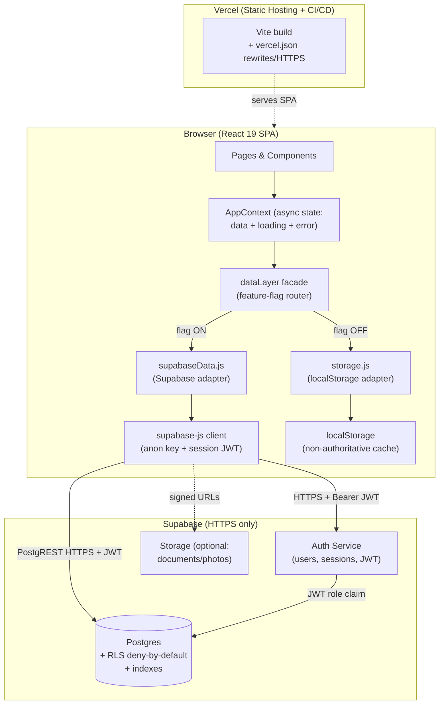

# Design Document: Supabase Online Platform

## Overview

This design describes how Propela Ops migrates from a browser-only, `localStorage`-backed single-page application to an online, multi-user platform backed by Supabase. It realizes the requirements in `requirements.md`, whose central promise is that the application "still works fine" no matter how data changes — through the UI, through a bulk/mass update, or through a manual edit made directly in the database — and that no stale client copy ever overrides authoritative data.

The current application (package `propela-ops`, React 19 + Vite 8) persists ~48 data domains to browser `localStorage` through a single storage abstraction (`src/lib/storage.js`) consumed by one React context (`src/context/AppContext.jsx`). Data is seeded from generators in `src/data/*`. There is no backend today.

After this feature:

- **Supabase Postgres is the single Source_Of_Truth** for all Data_Domain records (Req 1.3). Browser `localStorage` is demoted to a non-authoritative cache and is never treated as authoritative (Req 1.7).
- **Supabase Auth** provides real logins and sessions (Req 3), and **Postgres Row Level Security (RLS)** enforces role-based access for the `Recruiter` and `Admin` roles with deny-by-default (Req 4, Req 10.3–10.4).
- A new **async Data_Layer** mirrors the existing `storage.js` API surface per domain, adding loading/error state, pagination, filtering, and optimistic-concurrency conflict detection (Req 6, Req 2, Req 12).
- A **feature flag** routes all reads/writes to either the legacy `localStorage` storage or the Supabase-backed Data_Layer, enabling a safe phased rollout (Req 9.1–9.2).
- An **idempotent, re-runnable migration** loads 100% of existing seed/sample data into a relational schema, preserving IDs and referential integrity, and reporting per-domain counts (Req 5, Req 11.7).
- The frontend deploys on **Vercel** with env-var configuration, SPA rewrites, HTTPS redirect, and auto-deploy on push (Req 7, Req 8).

### Design Goals

1. **Authoritative reads and writes** — every read reflects the committed database state; every write is confirmed by the database before being treated as committed (Req 1.1–1.4, Req 2.1–2.3).
2. **No lost updates** — concurrent or stale writes are detected and rejected, never silently applied (Req 2.4–2.6, Req 11.2–11.3).
3. **Minimal application rewrite** — the Data_Layer mirrors `storage.js` per-domain function names so pages and `AppContext` adopt it with small, mechanical changes (Req 6.1).
4. **Deny-by-default security** — RLS is enabled on every domain table; absence of a policy means zero rows returned (Req 10.3–10.4).
5. **Safe, reversible rollout** — a feature flag lets the team switch between legacy storage and Supabase without code forks (Req 9.1–9.2).
6. **Secrets never reach the browser** — only the `VITE_SUPABASE_URL` and `VITE_SUPABASE_ANON_KEY` are exposed; the service_role key and DB password are never bundled (Req 7.2, Req 10.6).

## Architecture

The system has two runtime tiers: the React SPA hosted on Vercel, and the Supabase backend (Auth + Postgres with RLS + optional Storage). The critical architectural element is the **Data_Layer seam**: a single module that both the legacy `storage.js` and the new Supabase adapter conform to, selected at runtime by a feature flag.



### Key architectural decisions

- **The Data_Layer is a facade over two adapters.** `dataLayer` exposes one async API. Internally it delegates to `storageAdapter` (legacy `localStorage`) or `supabaseAdapter` (Supabase) based on `isFeatureEnabled('SUPABASE_BACKEND')`. Because the flag is read once at module init, exactly one adapter services all traffic — satisfying the mutual-exclusion requirements (Req 9.1–9.2).
- **PostgREST is the network protocol.** `supabase-js` talks to Postgres over HTTPS via PostgREST, automatically attaching the session JWT as a Bearer token (Req 3.7, Req 10.1). RLS runs inside Postgres, so it applies regardless of client origin (Req 4.6).
- **RLS is the authorization boundary, not the client.** The frontend uses only the anon key; all row visibility and write permission is decided by Postgres policies keyed on the authenticated user's role claim (Req 4.2, Req 4.6, Req 10.3).
- **Optimistic concurrency at the row level.** Each domain row carries a `version` integer (and `updated_at`). Updates are conditional on the base version the client last read; a mismatch yields zero affected rows, which the adapter maps to a conflict (Req 2.4–2.5, Req 11.2–11.3).

## Components and Interfaces

### Component inventory

| Component | Path (new/changed) | Responsibility |
|---|---|---|
| Supabase client | `src/lib/supabaseClient.js` | Create configured `supabase-js` client from validated env vars |
| Config validation | `src/lib/config.js` (extended) | Read + validate `VITE_SUPABASE_URL`, `VITE_SUPABASE_ANON_KEY` at startup (Req 7.1, 7.3) |
| Feature flag | `src/lib/featureFlags.js` (extended) | Add `SUPABASE_BACKEND` flag |
| Data_Layer facade | `src/lib/dataLayer/index.js` | Public async API; flag-based routing to an adapter (Req 9.1–9.2) |
| Legacy adapter | `src/lib/dataLayer/storageAdapter.js` | Wrap existing `storage.js` behind the async API |
| Supabase adapter | `src/lib/dataLayer/supabaseAdapter.js` | Per-domain CRUD, pagination, filtering, conflict detection, error mapping |
| Domain registry | `src/lib/dataLayer/domains.js` | Table name, PK, column↔JSON mapping, list config per domain |
| Auth module | `src/lib/auth.js` + `src/context/AuthContext.jsx` | Login/logout, session lifecycle, role exposure (Req 3, 4) |
| App context | `src/context/AppContext.jsx` (changed) | Consume Data_Layer async; expose data + loading + error per domain |
| Migration | `supabase/migrations/*.sql` + `scripts/migrate-seed-data.mjs` | Schema DDL + idempotent seed import (Req 5) |
| Deployment config | `vercel.json`, `.env.example` | SPA rewrite, HTTPS, env docs (Req 7, 8) |

### Data_Layer public API (mirrors `storage.js`)

The legacy module exposes per-domain getters/savers (`getNurses`/`saveNurses`, `getFacilities`/`saveFacilities`, …). The Data_Layer preserves those names but returns Promises and result envelopes. For every domain served by `storage.js`, the Data_Layer exposes at least one retrieval and one persistence operation (Req 6.1). Representative signatures:

```js
// src/lib/dataLayer/index.js  — result-envelope shape used everywhere
// { data, error, loading }  — error is null on success; data is [] (never null) for empty lists (Req 6.3)

// Retrieval (paginated, filterable) — Req 6.2, 12.1, 12.3
async function listNurses({ page = 1, pageSize = 25, filters = {}, sort } = {}): Promise<{
  data: Nurse[], error: DataError|null, page: number, pageSize: number, total: number
}>

async function getNurse(id): Promise<{ data: Nurse|null, error: DataError|null }>

// Persistence — returns the committed row incl. new version (Req 6.4, 2.5)
async function createNurse(record): Promise<{ data: Nurse, error: DataError|null }>
async function updateNurse(id, changes, baseVersion): Promise<{ data: Nurse|null, error: DataError|null, conflict?: ConflictInfo }>
async function deleteNurse(id, baseVersion): Promise<{ error: DataError|null, conflict?: ConflictInfo }>

// Bulk / mass update — atomic (Req 2.3, 11.5–11.6)
async function bulkUpsertNurses(records): Promise<{ data: Nurse[], error: DataError|null }>
```

The whole-collection `saveNurses(array)` style used by `AppContext` today is preserved as a compatibility shim that diffs against last-read state and issues create/update/delete with version checks, so existing callers keep working during migration (Req 6.1).

### Loading / error state model

Every async operation drives three observable states so the UI can render spinners and errors (Req 6.6, 6.7, 12.2):

```js
// Per-domain slice held in AppContext
{ items: [], loading: false, error: null, page: 1, pageSize: 25, total: 0, staleWarning: false }
```

- `loading` is `true` while an operation is in flight, `false` on completion or failure (Req 6.6). The UI shows a loading indicator only after 300 ms to avoid flicker (Req 12.2).
- `error` holds a mapped `DataError` when an operation fails; it is never silently discarded (Req 6.7).
- `staleWarning` is set when the database is classified unreachable, so displayed data is visibly marked potentially stale (Req 9.3).

### AppContext consumption

`AppContext` changes from synchronous `useState(() => getNurses())` initializers to async loads via the Data_Layer. Each domain gets a small reducer slice `{ items, loading, error, page, pageSize, total }`, a `loadX({page,filters})` action, and write actions (`createX`, `updateX`, `deleteX`) that carry the last-read `version`. The public context shape (the `nurses`, `facilities`, … arrays plus `updateNurses`-style updaters) is preserved so most pages need no change; updaters gain async behavior and surface conflicts through the toast system already present in the context.

### Authentication & Authorization interface

`AuthContext` wraps `supabase-js` auth:

```js
signIn(email, password)   // Req 3.2, 3.4–3.6
signOut()                 // Req 3.8: clears all tokens
getSession()              // current session or null
useAuth() -> { user, role, session, loading, error, signIn, signOut }
```

A route guard redirects unauthenticated users to `/login` within 2 s (Req 3.1) and blocks data views until a session exists. The session JWT is attached to every PostgREST request automatically by the client (Req 3.7).

## Data Models

### Modeling strategy

The existing seed records are document-shaped JSON: each domain is an array of objects with **stable string IDs** (`nurse-001`, `placement-001`, `uk-001`) and **nested substructures** (e.g. nurse `scorecardFields`, `communicationLog[]`; placement `contractDetails`, `relocationChecklist[]`, `stageHistory[]`). The schema therefore uses a **hybrid relational + JSONB** approach:

- **Top-level scalar fields** that are filtered, sorted, or joined become typed columns with indexes.
- **Nested objects/arrays** that are read/written as a unit become `jsonb` columns, preserving structure exactly for write-then-read fidelity (Req 11.1).
- **String IDs are preserved as the primary key** (`text` / `citext`), never regenerated, so cross-domain references stay valid (Req 5.3, 11.7).

### Common columns (applied to every Data_Domain table)

Every domain table includes a shared set of columns supporting authorization, concurrency, and auditing:

```sql
-- Convention applied to all domain tables
id           text PRIMARY KEY,                 -- preserves existing seed IDs (Req 5.3)
owner_id     uuid REFERENCES auth.users(id),   -- tenancy/ownership for RLS (Req 4.2)
version      integer NOT NULL DEFAULT 1,       -- optimistic concurrency token (Req 2.5, 11.3)
created_at   timestamptz NOT NULL DEFAULT now(),
updated_at   timestamptz NOT NULL DEFAULT now()
-- + domain-specific typed columns and jsonb columns
```

A shared trigger enforces `updated_at = now()` and `version = version + 1` on every `UPDATE`, so the concurrency token advances automatically and cannot be bypassed by a manual edit in the Supabase table editor (Req 2.2, 2.5).

```sql
CREATE OR REPLACE FUNCTION bump_version() RETURNS trigger AS $$
BEGIN
  NEW.updated_at := now();
  NEW.version := OLD.version + 1;
  RETURN NEW;
END; $$ LANGUAGE plpgsql;
-- CREATE TRIGGER trg_bump_version BEFORE UPDATE ON <table>
--   FOR EACH ROW EXECUTE FUNCTION bump_version();
```

### Schema areas (grouping the ~48 domains)

Rather than 48 verbose DDL blocks, the domains group into logical schema areas. Each area follows the common-columns + hybrid pattern above.

| Area | Representative domains (tables) | Notes |
|---|---|---|
| **Recruitment core** | `nurses`, `facilities`, `cohorts`, `placements` | Highest-traffic list views; fully typed core columns + JSONB for nested detail |
| **Acquisition** | `referrers`, `community_channels`, `events`, `outreach_templates` | Marketing/sourcing pipeline |
| **Documents** | `documents`, `document_templates`, `verification_queue` | FK to `nurses`; JSONB for template bodies |
| **Communications** | `communications`, `comm_email_templates`, `alert_rules`, `alert_history`, `notification_preferences` | Message logs and rules |
| **Notifications** | `notifications`, `notification_alerts`, `notif_alert_config`, `notification_log`, `toast_preferences` | Inbox + config (mostly per-user) |
| **Reporting** | `scheduled_reports`, `export_history`, `dashboard_layouts`, `active_dashboard_layout` | JSONB widget layouts |
| **Integrations** (Admin-only) | `integrations`, `api_endpoints`, `api_keys`, `webhooks`, `webhook_delivery_log`, `sync_status` | Restricted from Recruiter (Req 4.3) |
| **Audit & activity** | `activity_feed`, `audit_log`, `user_sessions`, `change_history` | Append-mostly; time-ordered indexes |
| **Automation** | `automation_rules`, `automation_templates`, `execution_log`, `scheduled_actions` | JSONB rule definitions |
| **Personalization** | `saved_views`, `recent_searches`, `recently_viewed` | Per-user (`owner_id` scoped) |
| **Help & onboarding** | `help_articles`, `onboarding_steps`, `feature_tours`, `onboarding_state`, `tour_state`, `article_votes` | Mostly reference/per-user content |
| **Configuration** (Admin-only) | `settings` | Restricted from Recruiter (Req 4.3) |

Singleton/per-user objects that `storage.js` stores as a single object (e.g. `settings`, `onboarding_state`, `sync_status`, `toast_preferences`) are modeled as a single-row-per-owner table (or a `key/value jsonb` config table) rather than a collection.

### Representative DDL — core tables

```sql
-- NURSES (Recruitment core) — Req 5.1, 5.4, 12.4
CREATE TABLE nurses (
  id                    text PRIMARY KEY,                 -- e.g. 'nurse-001' (Req 5.3)
  owner_id              uuid REFERENCES auth.users(id),
  full_name             text NOT NULL,
  preferred_name        text,
  pipeline_stage        text,                             -- common filter (Req 12.4)
  readiness_status      text,
  cohort_assigned       text,
  oet_status            text,
  final_score           numeric,
  tier                  text,
  email                 citext,
  scorecard_fields      jsonb NOT NULL DEFAULT '{}',      -- nested object, exact round-trip (Req 11.1)
  additional_certifications jsonb NOT NULL DEFAULT '[]',
  communication_log     jsonb NOT NULL DEFAULT '[]',
  attributes            jsonb NOT NULL DEFAULT '{}',      -- remaining scalar fields, forward-compatible
  version               integer NOT NULL DEFAULT 1,
  created_at            timestamptz NOT NULL DEFAULT now(),
  updated_at            timestamptz NOT NULL DEFAULT now()
);
CREATE INDEX idx_nurses_pipeline_stage ON nurses (pipeline_stage);   -- Req 12.4
CREATE INDEX idx_nurses_cohort ON nurses (cohort_assigned);
CREATE INDEX idx_nurses_owner ON nurses (owner_id);

-- FACILITIES
CREATE TABLE facilities (
  id          text PRIMARY KEY,
  owner_id    uuid REFERENCES auth.users(id),
  name        text NOT NULL,
  province    text,
  city        text,
  group_name  text,
  attributes  jsonb NOT NULL DEFAULT '{}',
  version     integer NOT NULL DEFAULT 1,
  created_at  timestamptz NOT NULL DEFAULT now(),
  updated_at  timestamptz NOT NULL DEFAULT now()
);
CREATE INDEX idx_facilities_province ON facilities (province);

-- COHORTS
CREATE TABLE cohorts (
  id          text PRIMARY KEY,
  owner_id    uuid REFERENCES auth.users(id),
  name        text NOT NULL,
  status      text,
  attributes  jsonb NOT NULL DEFAULT '{}',
  version     integer NOT NULL DEFAULT 1,
  created_at  timestamptz NOT NULL DEFAULT now(),
  updated_at  timestamptz NOT NULL DEFAULT now()
);

-- PLACEMENTS — FK to nurses & facilities enforces referential integrity (Req 5.4)
CREATE TABLE placements (
  id                   text PRIMARY KEY,                  -- 'placement-001'
  owner_id             uuid REFERENCES auth.users(id),
  nurse_id             text REFERENCES nurses(id) ON DELETE RESTRICT,
  facility_id          text REFERENCES facilities(id) ON DELETE RESTRICT,
  current_stage        text,                              -- common filter (Req 12.4)
  target_country       text,
  visa_status          text,
  match_score          integer,
  contract_details     jsonb NOT NULL DEFAULT '{}',
  relocation_checklist jsonb NOT NULL DEFAULT '[]',
  stage_history        jsonb NOT NULL DEFAULT '[]',
  version              integer NOT NULL DEFAULT 1,
  created_at           timestamptz NOT NULL DEFAULT now(),
  updated_at           timestamptz NOT NULL DEFAULT now()
);
CREATE INDEX idx_placements_stage ON placements (current_stage);
CREATE INDEX idx_placements_nurse ON placements (nurse_id);

-- DOCUMENTS — FK to nurses (Req 5.4)
CREATE TABLE documents (
  id            text PRIMARY KEY,
  owner_id      uuid REFERENCES auth.users(id),
  nurse_id      text REFERENCES nurses(id) ON DELETE CASCADE,
  doc_type      text,
  status        text,
  expiry_date   date,
  attributes    jsonb NOT NULL DEFAULT '{}',
  version       integer NOT NULL DEFAULT 1,
  created_at    timestamptz NOT NULL DEFAULT now(),
  updated_at    timestamptz NOT NULL DEFAULT now()
);
CREATE INDEX idx_documents_nurse ON documents (nurse_id);
CREATE INDEX idx_documents_expiry ON documents (expiry_date);

-- AUDIT_LOG — append-mostly, time-ordered (Req 12.4)
CREATE TABLE audit_log (
  id          text PRIMARY KEY,
  owner_id    uuid REFERENCES auth.users(id),
  actor       text,
  action      text,
  entity_type text,
  entity_id   text,
  detail      jsonb NOT NULL DEFAULT '{}',
  created_at  timestamptz NOT NULL DEFAULT now()
);
CREATE INDEX idx_audit_created_at ON audit_log (created_at DESC);
CREATE INDEX idx_audit_entity ON audit_log (entity_type, entity_id);
```

**Pattern for the remaining domains:** each remaining table = common columns (`id text PK`, `owner_id`, `version`, `created_at`, `updated_at`) + a small set of typed columns for its common filter fields + a `jsonb attributes`/detail column capturing the rest of the seed object verbatim. This keeps the schema compact while guaranteeing exact round-trip of every persisted attribute (Req 5.1, 11.1). The `attributes` JSONB approach also means new fields added to seed generators do not require a migration to persist.

### Profiles / roles model

```sql
-- One profile per auth user; single role from {Recruiter, Admin} (Req 4.1)
CREATE TABLE profiles (
  user_id  uuid PRIMARY KEY REFERENCES auth.users(id) ON DELETE CASCADE,
  role     text NOT NULL CHECK (role IN ('Recruiter','Admin')),
  created_at timestamptz NOT NULL DEFAULT now()
);

-- Helper used by RLS policies; SECURITY DEFINER to read profiles under policy checks
CREATE OR REPLACE FUNCTION current_role_name() RETURNS text AS $$
  SELECT role FROM profiles WHERE user_id = auth.uid();
$$ LANGUAGE sql STABLE SECURITY DEFINER;
```

A user with no profile row resolves to `NULL` role, and every policy denies `NULL` — enforcing "no role ⇒ no access" (Req 4.7).


## Data-Access Layer Design

### Adapter routing (feature flag)

```js
// src/lib/dataLayer/index.js
import { isFeatureEnabled } from '../featureFlags';
import * as storageAdapter from './storageAdapter';
import * as supabaseAdapter from './supabaseAdapter';

// Read once at module init so exactly one adapter serves all traffic (Req 9.1-9.2)
const adapter = isFeatureEnabled('SUPABASE_BACKEND') ? supabaseAdapter : storageAdapter;

export const listNurses  = (opts) => adapter.listNurses(opts);
export const updateNurse = (id, changes, baseVersion) => adapter.updateNurse(id, changes, baseVersion);
// ...one binding per domain operation
```

### Generic domain operations (Supabase adapter)

Per-domain functions are thin wrappers over generic helpers parameterized by the domain registry (`domains.js`), which holds the table name, PK, typed columns, JSONB columns, and default list config.

```js
// src/lib/dataLayer/supabaseAdapter.js
import { supabase } from '../supabaseClient';
import { mapError } from './errors';

const MAX_PAGE = 100, DEFAULT_PAGE = 25;

export async function list(table, { page = 1, pageSize = DEFAULT_PAGE, filters = {}, sort } = {}) {
  const size = Math.min(Math.max(1, pageSize), MAX_PAGE);   // clamp (Req 12.1)
  const from = (Math.max(1, page) - 1) * size;
  let q = supabase.from(table).select('*', { count: 'exact' }).range(from, from + size - 1);
  for (const [col, val] of Object.entries(filters)) q = q.eq(col, val); // server-side filter (Req 12.3)
  if (sort) q = q.order(sort.column, { ascending: sort.asc });
  const { data, error, count } = await q;
  if (error) return { data: [], error: mapError(error), page, pageSize: size, total: 0 };
  return { data: data ?? [], error: null, page, pageSize: size, total: count ?? 0 }; // [] not null (Req 6.3)
}

// Conditional update on base version = optimistic concurrency (Req 2.5, 11.3)
export async function update(table, id, changes, baseVersion) {
  const { data, error } = await supabase
    .from(table).update(changes)
    .eq('id', id).eq('version', baseVersion)   // no match => stale/conflict
    .select().maybeSingle();
  if (error) return { data: null, error: mapError(error) };
  if (!data) {                                  // zero rows changed => conflict
    const { data: current } = await supabase.from(table).select('*').eq('id', id).maybeSingle();
    return { data: null, error: null, conflict: { current } };  // Req 2.5, 2.6
  }
  return { data, error: null };
}
```


### Mass update (atomic)

Mass updates are executed as a single transactional unit so a subsequent read shows all-or-nothing (Req 11.5–11.6, 2.3). Since PostgREST batches are not transactional across independent rows, the design uses a Postgres RPC (`bulk_update_<domain>`) wrapping the batch in a single function/transaction:

```sql
-- Applies all changes atomically; any row failure rolls back the whole call (Req 11.6)
CREATE OR REPLACE FUNCTION bulk_update_nurses(payload jsonb) RETURNS setof nurses AS $$
  UPDATE nurses n SET ... FROM jsonb_to_recordset(payload) AS c(id text, version int, ...)
  WHERE n.id = c.id AND n.version = c.version   -- per-row conflict check inside the txn
  RETURNING n.*;
$$ LANGUAGE sql;
```

If any element's version check fails, the caller receives a conflict result and the transaction commits none of the batch.

### Conflict-detection strategy

1. On read, the client retains each row's `version`.
2. On update/delete, the client sends `baseVersion`; the SQL condition `version = baseVersion` gates the write.
3. Zero affected rows ⇒ the row changed since read ⇒ adapter returns a `conflict` carrying the current committed value (Req 2.5, 2.6, 11.3).
4. The `bump_version` trigger increments `version` on every commit — including manual edits in the Supabase editor — so stale client writes are always caught (Req 2.2, 2.4).

### Error mapping

`mapError` translates PostgREST/Supabase errors into a stable `DataError { code, message, cause }` the UI can branch on (Req 6.7): `NETWORK` (connectivity/timeout), `AUTH` (401/expired), `FORBIDDEN` (RLS/403 → authorization error, Req 4.5), `VALIDATION` (constraint/422), `CONFLICT` (version mismatch), `UNKNOWN`. A per-request timeout (10 s for the commit gate, Req 1.4/1.5; 10 s for reads, Req 9.3/12.6) wraps each call via `Promise.race`, producing a `NETWORK` error on expiry.


## Authentication & Authorization Design

### Authentication flow

```mermaid
sequenceDiagram
  participant U as User
  participant FE as Frontend (AuthContext)
  participant Auth as Supabase Auth
  participant PG as Postgres (RLS)
  U->>FE: submit email + password
  FE->>FE: validate non-empty fields (Req 3.5)
  FE->>Auth: signInWithPassword (HTTPS)
  Auth-->>FE: session { access_token JWT, expires_in 3600 } (Req 3.2)
  FE->>FE: store session; route to authorized views (Req 3.3)
  U->>FE: open data view
  FE->>PG: PostgREST request + Bearer JWT (Req 3.7)
  PG->>PG: evaluate RLS using role claim
  PG-->>FE: only permitted rows (Req 4.2)
```

- **Session/token handling:** `supabase-js` persists the session and refreshes tokens; the access token (60-minute expiry, Req 3.9) is attached to every request automatically (Req 3.7). On logout, `signOut()` clears all tokens from browser storage within 2 s (Req 3.8).
- **Guarding:** a `RequireAuth` route wrapper redirects unauthenticated users to `/login` within 2 s (Req 3.1) and blocks all data views. Expired sessions force re-authentication before further DB operations (Req 3.9).
- **Error handling:** invalid credentials produce a generic "invalid credentials" message that does not reveal which field was wrong (Req 3.4); auth timeout/unavailability denies access, shows a temporary-unavailability message, and preserves the entered username (Req 3.6).

### Roles model

Roles are stored in a `profiles` table (one row per `auth.users` id, role ∈ {Recruiter, Admin}, Req 4.1). RLS policies resolve the caller's role via the `current_role_name()` helper (DB lookup), avoiding dependence on custom JWT claims that require re-login to refresh. `useAuth().role` mirrors the profile for UI gating, but the authoritative decision is always in Postgres (Req 4.2, 4.6).

### RLS policy patterns

```sql
-- Enable RLS on every domain table (Req 10.3); with no policy, access is denied (Req 10.4, 4.4-default)
ALTER TABLE nurses ENABLE ROW LEVEL SECURITY;

-- Admin: full access to all domains (Req 4.4)
CREATE POLICY admin_all ON nurses FOR ALL
  USING (current_role_name() = 'Admin')
  WITH CHECK (current_role_name() = 'Admin');

-- Recruiter: read/write operational recruitment data (Req 4.2)
CREATE POLICY recruiter_ops ON nurses FOR ALL
  USING (current_role_name() = 'Recruiter')
  WITH CHECK (current_role_name() = 'Recruiter');

-- Restricted domains (settings, integrations, api_keys, webhooks, profiles/user-mgmt):
-- ONLY an Admin policy is defined, so Recruiters are denied by default (Req 4.3)
ALTER TABLE integrations ENABLE ROW LEVEL SECURITY;
CREATE POLICY admin_only ON integrations FOR ALL
  USING (current_role_name() = 'Admin')
  WITH CHECK (current_role_name() = 'Admin');
```

Because a user with no `profiles` row resolves to `NULL`, every `current_role_name() = '...'` check fails and all requests are denied (Req 4.7). RLS runs inside Postgres, so anon-key requests from any origin are still constrained (Req 4.6). Credentials live only in Supabase Auth's managed storage, never in application tables (Req 10.7).


## Migration Design

The migration has two parts: **schema creation** (declarative SQL migrations) and **seed/data import** (a Node script that transforms existing `src/data/*` generators into rows).

### Schema creation

SQL migration files live in `supabase/migrations/NNNN_*.sql` and are applied via the Supabase CLI. They create tables (per Data Models), the `bump_version` trigger, indexes, `profiles`, the `current_role_name()` helper, RLS enablement, and policies. Referential integrity is enforced by foreign keys (Req 5.4).

### Seed/data import

```
scripts/migrate-seed-data.mjs
  1. Load every seed generator (seedNurses(), seedFacilities(), ... seedHelp()).
  2. For each domain: transform each object -> row (typed columns + jsonb detail),
     PRESERVING the object's `id` as the primary key (Req 5.3).
  3. Insert in referential-integrity order: independent tables first
     (nurses, facilities, cohorts), then dependents (placements, documents) (Req 5.4).
  4. Use UPSERT keyed on primary key so re-runs create no duplicates (Req 5.8, 11.7).
  5. Wrap each domain's related set in a transaction; on any constraint violation,
     roll back that related set and report the failing record + constraint (Req 5.5).
  6. Report per-domain { sourceCount, loadedCount, failedCount } (Req 5.6).
  7. If loadedCount != sourceCount for any domain, mark migration FAILED (Req 5.7).
```

Idempotency uses `INSERT ... ON CONFLICT (id) DO UPDATE` so a second run reconciles rather than duplicates. Because IDs are preserved and unique, the source→migrated mapping is a bijection with zero duplicates and zero omissions (Req 11.7).

```js
// Representative upsert (idempotent, ID-preserving)
await supabaseAdmin.from('nurses').upsert(
  nurses.map(toNurseRow),      // maps id + typed cols + jsonb detail
  { onConflict: 'id' }
);
```

The import uses the **service_role key**, run only from a trusted CI/local environment — never in the frontend (Req 7.2, 10.6).

## Configuration & Deployment Design

### Environment variables

| Variable | Where | Purpose |
|---|---|---|
| `VITE_SUPABASE_URL` | Frontend (build + runtime) | Supabase project URL (Req 7.1) |
| `VITE_SUPABASE_ANON_KEY` | Frontend | Public anon key, RLS-constrained (Req 7.1) |
| `SUPABASE_SERVICE_ROLE_KEY` | CI/migration only | Privileged; NEVER in frontend bundle (Req 7.2, 10.6) |
| `SUPABASE_DB_PASSWORD` | CI/migration only | Never in frontend (Req 7.2) |

### Startup validation

`config.js` validates required config at startup. If `VITE_SUPABASE_URL` or `VITE_SUPABASE_ANON_KEY` is missing/empty, the app renders a configuration-error screen naming each missing variable within 2 s, does not mount the main app, and issues no DB calls (Req 7.3).

```js
export function validateSupabaseConfig() {
  const missing = [];
  if (!import.meta.env.VITE_SUPABASE_URL) missing.push('VITE_SUPABASE_URL');
  if (!import.meta.env.VITE_SUPABASE_ANON_KEY) missing.push('VITE_SUPABASE_ANON_KEY');
  return { ok: missing.length === 0, missing };   // drives ConfigError screen (Req 7.3)
}
```

### `.env.example`

The existing `.env.example` is extended with `VITE_SUPABASE_URL=` and `VITE_SUPABASE_ANON_KEY=` placeholders and no real secrets (Req 7.4). Service_role/DB password are intentionally excluded. `.env` remains gitignored (Req 7.5, 10.5).

### Vercel configuration

```json
// vercel.json
{
  "buildCommand": "npm run build",
  "outputDirectory": "dist",
  "rewrites": [{ "source": "/((?!assets/).*)", "destination": "/index.html" }],
  "redirects": [{ "source": "/(.*)", "has": [{ "type": "header", "key": "x-forwarded-proto", "value": "http" }], "destination": "https://$host/$1", "permanent": true }]
}
```

- SPA rewrite resolves client-side routes to `index.html`, excluding static assets (Req 8.8).
- HTTPS is served by default and HTTP is redirected (Req 8.6–8.7).
- Auto-deploy on push builds within the platform pipeline; a failed/timed-out build retains the previous deployment and records the failure (Req 8.2–8.5).
- Required env vars are set in Vercel project settings and applied per deployment (Req 8.9). A build-time guard fails the build if required config is absent (Req 8.10).


## Correctness Properties

*A property is a characteristic or behavior that should hold true across all valid executions of a system — essentially, a formal statement about what the system should do. Properties serve as the bridge between human-readable specifications and machine-verifiable correctness guarantees.*

The properties below were derived from the acceptance-criteria prework and consolidated to remove redundancy (e.g. the conflict rule in 2.4/2.5/11.3 is one property; mass-update atomicity in 2.3/11.5/11.6 is one property; migration identity in 5.2/5.3/5.8/11.7 is one property). Each property is universally quantified and testable with a property-based testing library against the Data_Layer logic (using an in-memory/mocked store or a local Supabase test project for the SQL-level ones). Suggested generators and oracles are noted.

### Property 1: Write-then-read consistency (round-trip)

*For any* valid Data_Domain record, writing it and then reading the same record with no intervening write returns a value equal across all fields (including nested JSONB substructures) to the value written.

- Generator: random valid domain records with nested objects/arrays (scorecard fields, checklists, stage history).
- Oracle: `deepEqual(read(write(r)), r)` on all persisted fields.

**Validates: Requirements 11.1, 1.1, 1.2**

### Property 2: Concurrency conflict detection / no lost updates

*For any* record and any two updates U1, U2 submitted against the same base version, exactly one update commits and the other is rejected as a conflict; the final committed value equals one of the submitted updates and never a value reflecting neither, and a stale-base update never overwrites a newer committed value.

- Generator: a base record, a committed intervening update, and a stale update carrying the pre-change version.
- Oracle: committed value ∈ {U1, U2}; stale update returns `conflict` and leaves the newer value unchanged.

**Validates: Requirements 2.4, 2.5, 11.2, 11.3**

### Property 3: Update idempotence

*For any* record and any idempotent update applied two or more times with no intervening change, the resulting record state equals the state after applying the update once.

- Generator: random record + idempotent field-set change; apply N≥2 times using the version returned by each prior apply.
- Oracle: final field values equal the single-apply result.

**Validates: Requirements 11.4**

### Property 4: Mass-update atomic visibility and rollback

*For any* mass update over a set of records, a subsequent read returns either all post-update values or all pre-update values with no mix; and if the mass update fails before completion, no record retains a partially applied value.

- Generator: random set of records + a batch of changes; a variant injects a mid-batch failure.
- Oracle: read reflects all-or-none; on injected failure, every row equals its pre-update value.

**Validates: Requirements 2.3, 11.5, 11.6**

### Property 5: Migration round-trip identity preservation

*For any* seed dataset, running the migration (once or repeatedly) yields, per Data_Domain, a migrated row set whose IDs are in one-to-one correspondence with the source records — equal counts, distinct identities, zero duplicates, and zero omissions.

- Generator: randomized seed datasets per domain (varying sizes, including empty and with cross-domain references).
- Oracle: `set(migratedIds) == set(sourceIds)` and `count(migrated) == count(source)`; running twice leaves the set unchanged.

**Validates: Requirements 5.2, 5.3, 5.8, 11.7**

### Property 6: Adapter routing mutual exclusion

*For any* sequence of Data_Layer operations, when the `SUPABASE_BACKEND` flag is disabled only the legacy storage adapter is invoked and the Supabase adapter is never called, and when the flag is enabled only the Supabase adapter is invoked and the legacy storage adapter is never called.

- Generator: random sequences of read/write operations across domains, under each flag value.
- Oracle: spy on both adapters; assert exactly one adapter received calls matching the flag.

**Validates: Requirements 9.1, 9.2**

### Property 7: Empty-result contract

*For any* retrieval operation whose query matches no records, the Data_Layer returns an empty collection rather than null or an error.

- Generator: filters/ids guaranteed to match nothing over arbitrary backing data.
- Oracle: result `data` is `[]`, `error` is null.

**Validates: Requirements 6.3**

### Property 8: Validation rejection leaves the database unchanged

*For any* record that fails Data_Domain validation, the persistence operation is rejected with a validation error and the database state is identical before and after the attempt.

- Generator: records violating validation (missing required fields, wrong types).
- Oracle: operation returns `VALIDATION` error; snapshot of the store is unchanged.

**Validates: Requirements 6.5**

### Property 9: Async loading/error state discipline

*For any* Data_Layer operation, the loading state is true while the operation is in flight and returns to false on completion or failure, and on failure a non-null error is returned to the caller and exposed in the error state rather than discarded.

- Generator: operations that succeed and operations forced to fail/time out.
- Oracle: observed `loading` transitions to false after settle; failures yield non-null `error`.

**Validates: Requirements 6.6, 6.7**

### Property 10: Pagination clamping

*For any* requested page and page size, the Data_Layer requests at most 100 records, defaults to 25 when unspecified, treats non-positive sizes as invalid (clamped to the valid minimum), and returns no more than the effective page size.

- Generator: arbitrary integers for page and pageSize (including 0, negatives, and values > 100).
- Oracle: effective size ∈ [1,100]; returned length ≤ effective size.

**Validates: Requirements 12.1**

### Property 11: Server-side filter soundness and completeness

*For any* filter applied to a list Data_Domain over arbitrary backing data, every record returned satisfies the filter predicate (soundness) and no matching record within the requested page range is omitted (completeness), with filtering issued to the database rather than applied to a full client-side copy.

- Generator: random backing datasets + filter predicates on indexed fields.
- Oracle: all returned rows satisfy the predicate; the returned page equals the server-filtered expected page.

**Validates: Requirements 12.3, 2.3**

### Property 12: Session token attachment

*For any* sequence of Data_Layer database requests issued while a session is active, every outgoing request carries the session access token.

- Generator: random sequences of read/write operations under an active mocked session.
- Oracle: intercept requests; assert each includes the Bearer token.

**Validates: Requirements 3.7**

### Property 13: Configuration validation completeness

*For any* subset of the required configuration values ({`VITE_SUPABASE_URL`, `VITE_SUPABASE_ANON_KEY`}) that is missing or empty at startup, the configuration error names exactly the missing values, the main application is not rendered, and no database operation is attempted.

- Generator: all combinations of present/missing/empty for the two required values.
- Oracle: reported missing set equals the actually-missing set; app-mount and DB-call flags are false when any is missing.

**Validates: Requirements 7.3**


## Error Handling

All Data_Layer operations return a result envelope (`{ data, error, conflict? }`) rather than throwing across the async boundary, so callers handle failures explicitly and errors are never silently dropped (Req 6.7).

| Scenario | Detection | Behavior |
|---|---|---|
| **Write failure / no ack in 10 s** | `Promise.race` timeout or PostgREST error | Classify write failed; show "not saved" error; keep DB record unchanged; retain user input for resubmission; show retry control (Req 1.4–1.5, 9.4–9.5) |
| **Retry succeeds ≤10 s** | Retry call acknowledged | Indicate saved; clear failed state (Req 9.6) |
| **Read failure / no response in 10 s** | Timeout or error | Show "could not load"/"connectivity lost"; do NOT present localStorage as authoritative; mark displayed data potentially stale (Req 1.6, 9.3) |
| **Write conflict (stale version)** | Zero rows affected on conditional update | Return `conflict` with current committed value; UI notifies, shows current value, retains input (Req 2.5–2.6, 11.3) |
| **Authorization denied (RLS/403)** | `FORBIDDEN` mapped error | Show access-denied message within 2 s; no records modified (Req 4.5) |
| **Auth expired/invalid (401)** | `AUTH` mapped error | Force re-authentication before further DB ops (Req 3.9) |
| **Validation failure** | Pre-write validation / constraint error | Reject; return `VALIDATION` error; leave DB unchanged (Req 6.5) |
| **No secure connection** | Non-HTTPS / TLS failure | Reject without transmitting records; return secure-connection error (Req 10.2) |
| **List retrieval failure/timeout** | Timeout/error on list | Remove loading indicator; show error; preserve previously displayed records (Req 12.6) |
| **Migration constraint violation** | DB constraint error mid-batch | Roll back the related set; report failing record + violated constraint; mark migration failed (Req 5.5, 5.7) |

Retries use bounded exponential backoff for transient `NETWORK` errors; `FORBIDDEN`, `AUTH`, `VALIDATION`, and `CONFLICT` are not auto-retried because they will not succeed on repeat.

## Testing Strategy

A dual approach combines example-based tests (specific behaviors, edge cases, error conditions) with property-based tests (universal invariants), plus integration and RLS-policy tests for the parts that live in Postgres/Supabase.

### Unit tests (example-based)
- Auth flows: empty-field rejection (Req 3.5), invalid-credential message non-disclosure (Req 3.4), auth-unavailable handling (Req 3.6), logout clears tokens (Req 3.8), expiry forces re-auth (Req 3.9).
- Failure handling: write/read timeout behaviors, retry success, conflict UI, stale-data marking (Req 1.5–1.6, 9.3–9.6, 12.6).
- Config: startup validation screen, `.env.example` contents (Req 7.3–7.4).
- Migration reporting: per-domain counts, mismatch marks failed, rollback on bad record (Req 5.5–5.7).

### Property-based tests
- Implement Properties 1–13 with a JavaScript PBT library (**fast-check**, which fits the existing Vitest setup). Do NOT hand-roll property testing.
- Minimum **100 iterations** per property.
- Tag each test referencing its design property, e.g.:
  `// Feature: supabase-online-platform, Property 2: Concurrency conflict detection / no lost updates`
- Pure-logic properties (2, 3, 6, 7, 8, 9, 10, 12, 13) run against an in-memory fake store/mocked client for speed; store-level properties (1, 4, 5, 11) run against a local Supabase/Postgres test instance to exercise the trigger, conditional updates, RPC transactions, and constraints.

### Integration tests (Supabase test project / local)
- Read/write paths hit the real DB (Req 1.1, 2.1–2.2, 6.2, 6.4).
- Manual-edit visibility: edit a row directly, reload, assert new value (Req 2.2).
- Performance: page retrieval under datasets up to 100k rows returns within 2000 ms for ≥95% of requests (Req 12.5).

### RLS policy tests
- Role matrix: for `Recruiter` and `Admin`, attempt read/write across representative domains and assert permitted/denied outcomes (Req 4.2–4.4).
- Deny-by-default: a table with RLS enabled and no matching policy returns zero rows (Req 10.4).
- No-role user is denied everywhere (Req 4.7); anon-key requests remain RLS-constrained (Req 4.6).

### Smoke / build checks (CI)
- Grep build output to assert the service_role key and DB password never appear in bundles (Req 7.2, 10.6).
- Assert `.env` is gitignored and secrets are excluded from VCS (Req 7.5, 10.5).
- Assert RLS is enabled on every domain table (Req 10.3) and indexes exist for common filter fields (Req 12.4).
- Verify `vercel.json` SPA rewrite and HTTPS redirect (Req 8.6–8.8) and that a build fails when required config is missing (Req 8.10).

## Design Decisions & Tradeoffs

- **Optimistic concurrency vs pessimistic locking.** Chose optimistic concurrency (`version` column + conditional update). Recruitment edits rarely collide, so row locks would add contention and complexity for little benefit; version checks give lost-update protection with a single integer and map cleanly to the requirement to *reject* stale writes rather than block (Req 2.4–2.5, 11.2–11.3).
- **Adapter/facade over `storage.js` vs full rewrite.** Chose a facade whose per-domain function names mirror `storage.js`, letting `AppContext` and pages adopt async data with mechanical edits and keeping a legacy fallback for rollback. A full rewrite would be higher-risk and forfeit the feature-flag safety net (Req 6.1, 9.1–9.2).
- **Roles via DB lookup vs JWT claim.** Chose a `profiles` table lookup in RLS (`current_role_name()`). It avoids stale-claim problems (a role change would otherwise require re-login) at the cost of a small per-query lookup, which is acceptable and cacheable.
- **Hybrid relational + JSONB vs fully normalized schema.** Chose typed columns for filter/sort/join fields plus a JSONB detail column for nested/rarely-queried data. This preserves exact write-then-read fidelity for deeply nested seed structures (Req 11.1) and tolerates seed-shape changes without new migrations, trading some queryability on nested fields.
- **Preserving string IDs as primary keys vs new UUIDs.** Chose to keep existing IDs (`nurse-001`, …) as text PKs so cross-domain references and migration identity hold without a remapping table (Req 5.3, 11.7).
- **Mass update via Postgres RPC vs client-side batch.** Chose a transactional RPC so atomic all-or-none visibility and rollback are guaranteed by the database, which client-side batching over PostgREST cannot provide (Req 11.5–11.6).
- **Phased feature-flag rollout vs hard cutover.** Chose a flag so the team can validate the Supabase path in staging and revert instantly if issues arise, at the cost of maintaining both adapters during transition (Req 9.1–9.2).

---

*If gaps are identified in the approved requirements during design review, this design can return to the requirements clarification step before proceeding to the task-breakdown phase.*
