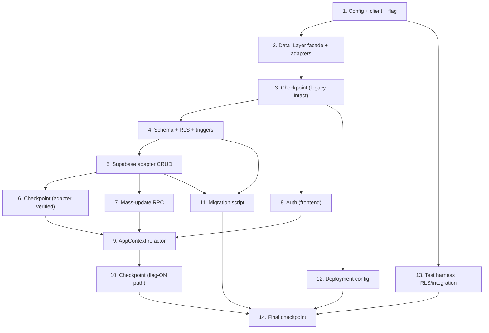

# Implementation Plan: Supabase Online Platform

## Overview

This plan converts the approved design into incremental, test-driven coding tasks that move Propela Ops from a `localStorage`-only SPA to a Supabase-backed, multi-user platform. The language and stack are fixed by the design: JavaScript (React 19 + Vite), SQL migrations under `supabase/migrations/`, a Node ESM migration script (`.mjs`), and property-based tests with **fast-check** on the existing **Vitest** setup.

The sequencing is deliberately safety-first:

1. Land configuration, the Supabase client, and the `SUPABASE_BACKEND` feature flag **off** by default.
2. Build the Data_Layer facade + both adapters so the legacy `localStorage` path keeps working unchanged (flag OFF) while the Supabase adapter is developed and tested behind the flag.
3. Create the database schema, RLS, triggers, and RPCs.
4. Fill in the Supabase adapter, auth, and the `AppContext` refactor, validating each behind the flag.
5. Migrate seed data, wire deployment, then run RLS/integration/smoke suites.

No big-bang integration at the end: each task wires its output into the running system, and the legacy adapter remains the live path until the flag is intentionally enabled.

Tasks marked with `*` are optional test sub-tasks and may be skipped for a faster MVP. Core implementation tasks are never optional. Property test sub-tasks reference the specific Property number and Requirement clauses from the design.

## Tasks

- [x] 1. Configuration, client, and feature-flag foundation
  - [x] 1.1 Extend `src/lib/config.js` with `validateSupabaseConfig()` and a `ConfigError` screen
    - Add `validateSupabaseConfig()` returning `{ ok, missing }` for `VITE_SUPABASE_URL` and `VITE_SUPABASE_ANON_KEY`
    - Render a configuration-error screen naming each missing variable within 2 s, do not mount the main app, and issue no DB calls when any is missing
    - _Requirements: 7.1, 7.3_
  - [x]* 1.2 Write property test for configuration validation completeness
    - **Property 13: Configuration validation completeness**
    - Generate all present/missing/empty combinations of the two required vars; assert reported missing set equals actual, app-mount flag false, DB-call flag false
    - **Validates: Requirements 7.3**
  - [x] 1.3 Create `src/lib/supabaseClient.js` from validated env vars
    - Instantiate the `supabase-js` client (add dependency) using the validated URL + anon key over HTTPS only
    - Export a single shared client; never reference the service_role key or DB password
    - _Requirements: 7.1, 7.2, 10.1_
  - [x] 1.4 Extend `.env.example` with Supabase placeholders
    - Add `VITE_SUPABASE_URL=` and `VITE_SUPABASE_ANON_KEY=` placeholders with no real secrets; exclude service_role/DB password
    - Confirm `.env` is listed in `.gitignore`
    - _Requirements: 7.4, 7.5, 10.5_
  - [x] 1.5 Extend `src/lib/featureFlags.js` with the `SUPABASE_BACKEND` flag (default OFF)
    - Add the flag so `isFeatureEnabled('SUPABASE_BACKEND')` is readable at module init; keep default disabled to preserve the legacy path
    - _Requirements: 9.1, 9.2_

- [x] 2. Data_Layer facade and adapter skeletons (legacy path stays live)
  - [x] 2.1 Create `src/lib/dataLayer/domains.js` registry
    - Define per-domain metadata: table name, primary key, typed columns, JSONB columns, default list config, for every domain served by `src/lib/storage.js`
    - _Requirements: 5.1, 6.1_
  - [x] 2.2 Create `src/lib/dataLayer/errors.js` with `mapError` and `DataError`
    - Map PostgREST/Supabase errors into `DataError { code, message, cause }` with codes `NETWORK`, `AUTH`, `FORBIDDEN`, `VALIDATION`, `CONFLICT`, `UNKNOWN`
    - _Requirements: 6.7, 4.5, 10.2_
  - [x] 2.3 Create `src/lib/dataLayer/storageAdapter.js` wrapping `storage.js` behind the async API
    - Provide per-domain async retrieval/persistence and the whole-collection `saveX` shape by delegating to the existing synchronous `storage.js`, returning result envelopes
    - _Requirements: 6.1, 9.1_
  - [x] 2.4 Create `src/lib/dataLayer/index.js` flag-based router
    - Read `SUPABASE_BACKEND` once at module init and bind every per-domain operation to exactly one adapter (legacy or Supabase); export bindings mirroring `storage.js` names
    - _Requirements: 9.1, 9.2, 6.1_
  - [x]* 2.5 Write property test for adapter routing mutual exclusion
    - **Property 6: Adapter routing mutual exclusion**
    - Spy on both adapters; for random op sequences under each flag value, assert only the flagged adapter is invoked
    - **Validates: Requirements 9.1, 9.2**

- [x] 3. Checkpoint - legacy path intact behind flag
  - Ensure all tests pass and the app runs unchanged with the flag OFF; ask the user if questions arise.

- [x] 4. Database schema, triggers, roles, and RLS (core tables first)
  - [x] 4.1 Author core schema migration under `supabase/migrations/`
    - Create `nurses`, `facilities`, `cohorts`, `placements`, `documents`, `audit_log` using the common-columns pattern (`id text PK`, `owner_id`, `version`, `created_at`, `updated_at`) plus typed filter columns and JSONB detail columns; add FKs (placements→nurses/facilities, documents→nurses) and indexes on common filter fields
    - _Requirements: 5.1, 5.4, 11.1, 12.4_
  - [x] 4.2 Add the `bump_version()` trigger to every domain table
    - Set `updated_at = now()` and `version = OLD.version + 1` on each UPDATE so the concurrency token advances even for manual edits
    - _Requirements: 2.2, 2.5, 11.3_
  - [x] 4.3 Create `profiles` table and `current_role_name()` helper
    - One row per `auth.users` id with `role CHECK IN ('Recruiter','Admin')`; `current_role_name()` STABLE SECURITY DEFINER returning the caller's role (NULL when no profile)
    - _Requirements: 4.1, 4.7_
  - [x] 4.4 Enable RLS and add policies for core tables
    - `ENABLE ROW LEVEL SECURITY` on each core table; add Admin full-access and Recruiter ops policies keyed on `current_role_name()`; rely on deny-by-default (no policy ⇒ zero rows, NULL role ⇒ denied)
    - _Requirements: 4.2, 4.4, 10.3, 10.4, 4.7_
  - [x] 4.5 Author remaining schema-area migrations
    - Add tables for Acquisition, Documents extras, Communications, Notifications, Reporting, Integrations, Audit & activity, Automation, Personalization, Help & onboarding, and Configuration areas following the common-columns + hybrid JSONB pattern; model singleton/per-user objects (settings, onboarding_state, sync_status, toast_preferences) as single-row-per-owner tables; add the `bump_version` trigger and filter indexes to each
    - _Requirements: 5.1, 5.4, 11.1, 12.4_
  - [x] 4.6 Enable RLS and policies for remaining tables, including Admin-only domains
    - Enable RLS on every remaining table; define Admin-only policies (no Recruiter policy) for `settings`, `integrations`, `api_keys`, `webhooks`, and other configuration/integration/user-management domains so Recruiters are denied by default
    - _Requirements: 4.2, 4.3, 4.4, 10.3, 10.4_

- [x] 5. Supabase adapter generic operations (validated behind flag)
  - [x] 5.1 Implement generic `list` in `src/lib/dataLayer/supabaseAdapter.js`
    - Server-side pagination with page size clamp (default 25, max 100), server-side `eq` filtering, optional sort, `count: 'exact'` for total, and empty-collection contract (`data: []`, never null)
    - _Requirements: 6.2, 6.3, 12.1, 12.3_
  - [x]* 5.2 Write property test for pagination clamping
    - **Property 10: Pagination clamping**
    - Arbitrary page/pageSize (0, negatives, >100); assert effective size ∈ [1,100], default 25, returned length ≤ effective size
    - **Validates: Requirements 12.1**
  - [x]* 5.3 Write property test for empty-result contract
    - **Property 7: Empty-result contract**
    - Filters/ids matching nothing over arbitrary backing data; assert `data === []` and `error === null`
    - **Validates: Requirements 6.3**
  - [x]* 5.4 Write property test for server-side filter soundness and completeness
    - **Property 11: Server-side filter soundness and completeness**
    - Random datasets + filter predicates on indexed fields; assert all returned rows satisfy the predicate and the page equals the server-filtered expected page
    - **Validates: Requirements 12.3, 2.3**
  - [x] 5.5 Implement generic `get` and `create`
    - `get(table, id)` returns `{ data|null, error }`; `create(table, record)` validates then inserts and returns the committed row incl. `version`
    - _Requirements: 6.2, 6.4_
  - [x] 5.6 Implement generic conditional `update` with conflict detection
    - Conditional update gated on `eq('id').eq('version', baseVersion)`; zero rows ⇒ re-read current committed value and return `{ conflict: { current } }`
    - _Requirements: 2.4, 2.5, 2.6, 11.3_
  - [x]* 5.7 Write property test for concurrency conflict detection / no lost updates
    - **Property 2: Concurrency conflict detection / no lost updates**
    - Base record + committed intervening update + stale update; assert exactly one commits, final value ∈ submitted set, stale returns conflict and leaves newer value unchanged
    - **Validates: Requirements 2.4, 2.5, 11.2, 11.3**
  - [x] 5.8 Implement generic conditional `delete` and validation rejection
    - Version-gated delete returning conflict on mismatch; reject records failing Data_Domain validation with a `VALIDATION` error and leave the DB unchanged
    - _Requirements: 6.5, 2.5_
  - [x]* 5.9 Write property test for validation rejection leaving the database unchanged
    - **Property 8: Validation rejection leaves the database unchanged**
    - Records violating validation; assert `VALIDATION` error and byte-identical store snapshot before/after
    - **Validates: Requirements 6.5**
  - [x]* 5.10 Write property test for write-then-read consistency
    - **Property 1: Write-then-read consistency (round-trip)**
    - Random valid records with nested JSONB; assert `deepEqual(read(write(r)), r)` across all fields (run against a local Supabase/Postgres test instance to exercise the trigger)
    - **Validates: Requirements 11.1, 1.1, 1.2**
  - [x]* 5.11 Write property test for update idempotence
    - **Property 3: Update idempotence**
    - Apply an idempotent change N≥2 times using each returned version; assert final state equals single-apply result
    - **Validates: Requirements 11.4**
  - [x] 5.12 Add per-request timeout, loading/error envelope, and session attachment
    - Wrap calls in `Promise.race` (10 s) producing `NETWORK` errors; drive `{ data, error, loading }` so loading is true in-flight and false on settle, errors never discarded; rely on the client to attach the session Bearer JWT to every request
    - _Requirements: 6.6, 6.7, 1.4, 1.5, 3.7, 10.1_
  - [x]* 5.13 Write property test for async loading/error state discipline
    - **Property 9: Async loading/error state discipline**
    - Succeeding and forced-failing/timeout ops; assert loading returns to false and failures yield non-null error
    - **Validates: Requirements 6.6, 6.7**
  - [x] 5.14 Wire per-domain Supabase bindings and the `saveX` compatibility shim
    - Generate per-domain functions (`listNurses`, `getNurse`, `createNurse`, `updateNurse`, `deleteNurse`, …) from the registry; implement whole-collection `saveX(array)` that diffs against last-read state and issues versioned create/update/delete; export through the facade so flag ON routes here
    - _Requirements: 6.1, 1.1, 1.2, 2.1_

- [x] 6. Checkpoint - Supabase adapter verified behind flag
  - Ensure all adapter unit/property tests pass with the flag ON in tests while the app default stays OFF; ask the user if questions arise.

- [x] 7. Mass update (atomic) via Postgres RPC
  - [x] 7.1 Author `bulk_update_<domain>` transactional RPC migrations
    - Create SQL functions applying batched changes in one transaction with per-row `version` conflict checks so any failure rolls back the whole call
    - _Requirements: 2.3, 11.5, 11.6_
  - [x] 7.2 Implement adapter `bulkUpsert<Domain>` wrappers
    - Call the RPCs, return committed rows on success or a conflict result when any element's version check fails (committing none)
    - _Requirements: 2.3, 11.5, 11.6_
  - [x]* 7.3 Write property test for mass-update atomic visibility and rollback
    - **Property 4: Mass-update atomic visibility and rollback**
    - Random record sets + batched changes with an injected mid-batch failure variant; assert reads reflect all-or-none and injected failure leaves every row at its pre-update value (run against local Supabase/Postgres)
    - **Validates: Requirements 2.3, 11.5, 11.6**

- [x] 8. Authentication and authorization (frontend)
  - [x] 8.1 Create `src/lib/auth.js`
    - Implement `signIn(email, password)`, `signOut()` (clear all tokens), and `getSession()` over the `supabase-js` client with a 5 s auth timeout
    - _Requirements: 3.2, 3.6, 3.7, 3.8, 3.9_
  - [x] 8.2 Create `src/context/AuthContext.jsx` and `useAuth()`
    - Expose `{ user, role, session, loading, error, signIn, signOut }`; read role from `profiles` for UI gating (authoritative decision remains in Postgres RLS)
    - _Requirements: 3.3, 4.1, 4.2_
  - [x] 8.3 Add `RequireAuth` route guard
    - Redirect unauthenticated users to `/login` within 2 s, block data views, and force re-authentication when the session has expired before further DB operations
    - _Requirements: 3.1, 3.9_
  - [x] 8.4 Build the login screen
    - Empty-field validation, generic invalid-credential message (no field disclosure), and auth-unavailable/timeout handling that preserves the entered username
    - _Requirements: 3.4, 3.5, 3.6_
  - [x]* 8.5 Write unit tests for auth flows
    - Empty-field rejection, invalid-credential non-disclosure, auth-unavailable handling, logout clears tokens, expiry forces re-auth
    - _Requirements: 3.4, 3.5, 3.6, 3.8, 3.9_
  - [x]* 8.6 Write property test for session token attachment
    - **Property 12: Session token attachment**
    - Random op sequences under an active mocked session; intercept requests and assert each carries the Bearer token
    - **Validates: Requirements 3.7**

- [x] 9. AppContext refactor to async data-layer consumption
  - [x] 9.1 Convert synchronous initializers to async per-domain slices
    - Replace `useState(() => getX())` with `{ items, loading, error, page, pageSize, total, staleWarning }` slices and `loadX({ page, filters })` actions calling the Data_Layer facade
    - _Requirements: 6.2, 6.6, 2.1, 12.1, 12.2_
  - [x] 9.2 Implement async write actions carrying `baseVersion` and conflict surfacing
    - `createX`/`updateX`/`deleteX` send the last-read version; on conflict, notify via the existing toast system, show the current committed value, and retain the user's unsaved input
    - _Requirements: 2.5, 2.6, 1.5_
  - [x] 9.3 Preserve the public context shape
    - Keep the `nurses`, `facilities`, … arrays and `updateX`-style updaters so existing pages need no change; updaters become async and route through the facade
    - _Requirements: 6.1_
  - [x] 9.4 Wire stale-data marking and retry control
    - Set `staleWarning` and mark displayed data potentially stale on unreachable DB; keep previously displayed records on list failure; expose a retry control that clears the failed state on success
    - _Requirements: 1.6, 9.3, 9.4, 9.5, 9.6, 12.6_
  - [x]* 9.5 Write unit tests for failure-handling UI behavior
    - Write/read timeout behaviors, retry success, conflict UI, stale-data marking, list-failure record preservation
    - _Requirements: 1.5, 1.6, 9.3, 9.4, 9.5, 9.6, 12.6_

- [x] 10. Checkpoint - full flag-ON path exercised in tests
  - Ensure all tests pass with the Supabase path enabled in the test environment; ask the user if questions arise.

- [x] 11. Seed-data migration script
  - [x] 11.1 Create `scripts/migrate-seed-data.mjs` transform + ID-preserving upsert
    - Load every seed generator, transform each object to a row (typed columns + JSONB detail) preserving its `id` as PK, and upsert with `onConflict: 'id'` in referential-integrity order (independent tables before dependents) using the service_role key from env (never bundled)
    - _Requirements: 5.2, 5.3, 5.4, 5.8, 7.2, 10.6_
  - [x] 11.2 Add per-related-set transactions with rollback and failing-record reporting
    - Wrap each domain's related set in a transaction; on a constraint violation, roll back that related set and report the failing record + violated constraint
    - _Requirements: 5.5_
  - [x] 11.3 Add per-domain count reporting and failure marking
    - Report `{ sourceCount, loadedCount, failedCount }` per domain; mark the migration FAILED when `loadedCount != sourceCount`; ensure re-runs create no duplicates (idempotent)
    - _Requirements: 5.6, 5.7, 5.8_
  - [x]* 11.4 Write property test for migration round-trip identity preservation
    - **Property 5: Migration round-trip identity preservation**
    - Randomized seed datasets (varying sizes, empty, cross-domain refs); assert `set(migratedIds) == set(sourceIds)`, equal counts, and running twice leaves the set unchanged
    - **Validates: Requirements 5.2, 5.3, 5.8, 11.7**
  - [x]* 11.5 Write unit tests for migration reporting
    - Per-domain counts, mismatch marks failed, rollback on a constraint-violating record
    - _Requirements: 5.5, 5.6, 5.7_

- [x] 12. Deployment configuration and build-time guards
  - [x] 12.1 Add `vercel.json`
    - SPA rewrite resolving client routes to `index.html` excluding `assets/`, and an HTTP→HTTPS redirect
    - _Requirements: 8.6, 8.7, 8.8_
  - [x] 12.2 Add a build-time required-config guard
    - Fail the build (non-zero exit) when a required `VITE_` config value is absent so a broken config never deploys
    - _Requirements: 7.3, 8.10_
  - [x]* 12.3 Add CI smoke checks
    - Grep build output to assert the service_role key and DB password never appear in bundles; assert `.env` is gitignored; assert RLS is enabled on every domain table and indexes exist for common filter fields; verify `vercel.json` SPA rewrite and HTTPS redirect
    - _Requirements: 7.2, 10.3, 10.5, 10.6, 12.4, 8.6, 8.7, 8.8_

- [x] 13. Test harness, RLS, and integration suites
  - [x] 13.1 Set up fast-check on the existing Vitest configuration
    - Add the `fast-check` dependency and a shared PBT helper configured for a minimum of 100 iterations; establish the in-memory fake store/mocked client used by pure-logic property tests and the tag convention `Feature: supabase-online-platform, Property N: <name>`
    - _Requirements: 6.1_
  - [x]* 13.2 Write RLS policy tests
    - Role matrix (Recruiter vs Admin read/write across representative domains), deny-by-default on an RLS-enabled table with no matching policy, no-role user denied everywhere, and anon-key requests remaining RLS-constrained
    - _Requirements: 4.2, 4.3, 4.4, 4.6, 4.7, 10.4_
  - [x]* 13.3 Write integration tests against a local Supabase/test project
    - Read/write paths against the real DB and manual-edit visibility (edit a row directly, reload, assert the new value appears)
    - _Requirements: 1.1, 2.1, 2.2, 6.2, 6.4_

- [x] 14. Final checkpoint - Ensure all tests pass
  - Ensure all unit, property, RLS, integration, and smoke checks pass; confirm the feature flag can be toggled ON to cut over while the legacy adapter remains as a fallback; ask the user if questions arise.

## Task Dependency Graph

### Ordering and parallelizable tracks

- **Sequential spine:** 1 → 2 → 3 (checkpoint) establishes config, the flag, and the facade with the legacy path still live. Everything downstream depends on the facade seam.
- **Track A (backend/data):** 4 (schema/RLS) → 5 (adapter CRUD) → 6 (checkpoint) → 7 (mass-update RPC). This track validates the Supabase adapter entirely behind the flag before any cutover.
- **Track B (auth):** 8 can proceed in parallel with Track A after the checkpoint at 3, since it depends only on the client (1) and route structure.
- **Track C (deployment):** 12 (vercel.json + build guard) can proceed in parallel after 3; smoke checks (12.3) firm up once schema (4) exists.
- **Convergence:** 9 (AppContext refactor) requires the Supabase adapter (6), mass update (7), and auth (8) to be in place; it produces the flag-ON path validated at checkpoint 10.
- **Migration (11)** depends on the schema (4) and adapter transforms (5) and runs independently of the frontend refactor.
- **Test harness (13.1)** depends only on config (1) and can be set up early; RLS/integration suites (13.2–13.3) require the schema (4) and adapter (5).
- **Final checkpoint (14)** gates the intentional flag flip to cut over to Supabase while keeping the legacy adapter as an instant fallback.

## Notes

- Tasks marked with `*` are optional test sub-tasks and can be skipped for a faster MVP; core implementation tasks are never optional.
- The `SUPABASE_BACKEND` flag stays OFF by default so the legacy `localStorage` path keeps working throughout; the Supabase path is exercised via tests (flag ON in the test environment) before any production cutover.
- Property tests (Properties 1–13) use fast-check at a minimum of 100 iterations and are tagged `Feature: supabase-online-platform, Property N: <name>`. Pure-logic properties (2, 3, 6, 7, 8, 9, 10, 12, 13) run against an in-memory fake store/mocked client; store-level properties (1, 4, 5, 11) run against a local Supabase/Postgres test instance.
- Every task cites the requirement and/or property numbers it satisfies for traceability.
- External Supabase/Vercel dashboard steps (creating the project, setting env vars, connecting the Git repo) are captured in-repo as migrations, `vercel.json`, and `.env.example`; the one-time dashboard configuration is a manual operational step and is not a coding task.
